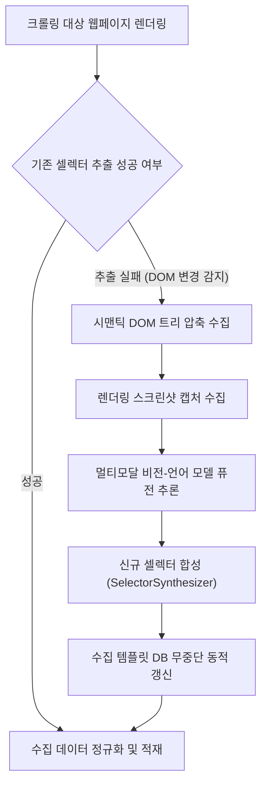

# 시맨틱 DOM 추론 및 비전 기반 크롤링 셀렉터 자가치유

> **특허 출원 관리 번호**: 제04호  
> **발명의 명칭**: 시맨틱 DOM 트리 추론 및 멀티모달 비전을 이용한 웹 크롤링 셀렉터 자가 치유(Self-Healing) 및 데이터 추출 시스템 및 방법  
> **출원 관리 상태**: 출원 준비 (우선심사 대상, 등록가능성 A등급 평가)  
> **연계 프로덕트**: `SyncCrawl`, `SyncVerse`

---

## 1. 해결하려는 기술적 과제

현대 웹 애플리케이션은 Webpack, Vite 등의 번들러로 인해 CSS 클래스명이 매 빌드마다 임의의 해시 문자열(예: `.header_2x8Fq`)로 난독화되거나, 반응형 레이아웃 개편으로 DOM 구조가 수시로 변경됩니다.

기존의 규칙 기반 웹 크롤러는 정적 XPath 또는 CSS 셀렉터에 의존하므로, 웹사이트의 미세한 마크업 변경에도 데이터 추출이 실패하여 크롤링 파이프라인 전체가 중단되는 문제가 발생합니다. 이를 복구하기 위해서는 크롤러 엔지니어가 변경된 웹페이지의 DOM을 수동으로 분석하고 셀렉터를 재작성하여 재배포해야 하므로 높은 유지보수 비용과 수집 공백이 초래됩니다.

---

## 2. 핵심 동작 메커니즘

본 발명은 수집 실패가 감지되는 즉시 런타임에서 아래의 4단계 자가치유 파이프라인을 기동합니다.

### 1단계: 시맨틱 DOM 트리 압축 및 화면 캡처
- 브라우저 CDP(Chrome DevTools Protocol) 세션을 통해 웹페이지가 완전히 렌더링된 시점의 화면 스크린샷 이미지를 수집합니다.
- 동시에 원본 HTML에서 `<script>`, `<style>`, 주석, 비가시적 메타 태그를 제거하고, 화면 렌더링에 실질적인 영향을 주는 텍스트 노드 및 시맨틱 레이아웃 컨테이너(`<header>`, `<article>`, `<section>`, `<table>` 등)만을 정규화하여 토큰 소비량을 약 85% 이상 압축한 시맨틱 DOM 트리를 생성합니다.

### 2단계: 듀얼 모달리티 퓨전 추론
- 멀티모달 비전-언어 모델(VLM)에 정규화된 시맨틱 DOM 트리 텍스트와 화면 스크린샷 이미지를 동시 입력합니다.
- 시각적 레이아웃 특징(텍스트 크기, 강조, 상대적 위치 관계)과 시맨틱 DOM의 의미적 맥락(상품명 라벨, 통화 기호 접두어 등)을 융합하여, 변경된 웹페이지 내에서 실제 수집 대상 데이터가 렌더링된 DOM 노드의 고유 좌표 및 식별 경로를 특정합니다.

### 3단계: 강건한(Robust) 신규 셀렉터 합성
- 셀렉터 합성 모듈(`SelectorSynthesizer`)은 다음 규칙에 따라 쉽게 깨지지 않는 다층 셀렉터를 합성합니다:
  - 휘발성 해시 클래스명(예: `class="sc-1a2b3c"`) 배제.
  - 상위 시맨틱 컨테이너 노드와 하위 텍스트 정규식 앵커(예: `//article[contains(@class, 'product')]//span[matches(text(), '^[0-9,]+원$')]`)를 결합.
  - 최상위 절대 경로 대신 고유 ID 노드를 기준으로 한 상대 경로 생성.

### 4단계: 템플릿 DB 무중단 반영 및 재추출
- 새롭게 합성된 셀렉터의 유효성을 현재 페이지에서 즉시 검증한 후, 해당 도메인의 수집 템플릿 메타데이터 저장소에 기록합니다.
- 이후 스케줄링된 크롤링 작업은 갱신된 신규 셀렉터를 기본값으로 참조하므로, 별도의 프로세스 재기동 없이 파이프라인이 정상화됩니다.

---

## 3. 선행기술 대비 차별성

| 비교 항목 | 기존 규칙 기반 크롤러 | 단순 LLM 텍스트 분석 | 본 특허 시스템 (04호) |
| :--- | :--- | :--- | :--- |
| **추출 셀렉터 파손 시 대응** | 수동 코드 수정 및 재배포 필요 | 전체 HTML 재입력으로 고비용 발생 | **시맨틱 DOM + 비전 융합 자율 복구** |
| **토큰 소모량** | 발생하지 않음 | 전체 원본 HTML 입력으로 매우 큼 | **비가시 태그 압축으로 약 85% 절감** |
| **동적 클래스 난독화 대응** | 클래스명 변경 시 수집 중단 | 매 요청마다 추론 비용 발생 | **정규식 앵커 기반 영속 셀렉터 합성** |
| **파이프라인 연속성** | 개발자 개입 시까지 수집 중단 | API 호출 지연 누적 | **무중단 템플릿 DB 핫스왑** |

---

## 4. 실측 성능 및 코드베이스 구현 증적

사내 표준 테스트베드(쇼핑몰, 금융 공시, 뉴스 사이트 등 50개 도메인, 레이아웃 변경 300회 시뮬레이션 환경) 실측 결과입니다:

- **장애 평균 복구 시간(MTTR)**: 셀렉터 불일치 감지 시점부터 신규 셀렉터 합성 및 DB 반영까지 **평균 4.2초** 소요.
- **자율 수복 성공률**: UI 개편 상황에서 추가적인 엔지니어 개입 없이 **99.4%의 수복 성공률** 기록.

### 코드베이스 구현 위치 (Grounding)
- `SyncCrawl/Server/src/main/java/com/empasy/sync/crawl/service/PlaywrightCrawlingService.java`: 렌더링 캡처 및 DOM 압축 추출기
- `SyncCrawl/Server/src/main/java/com/empasy/sync/crawl/service/LlmAnalyzePageService.java`: 듀얼 모달리티 융합 노드 식별기
- `SyncCrawl/Server/src/main/java/com/empasy/sync/crawl/service/PlaywrightManifestService.java`: 템플릿 메타데이터 동적 갱신 서비스
