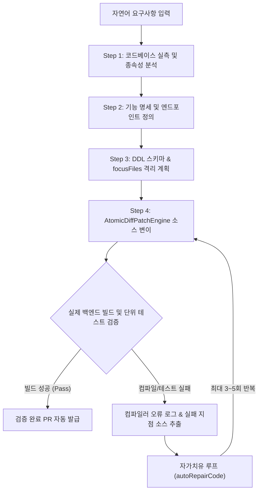

# 명세 기반 4단계 위저드 및 빌드 자가치유 시스템

> **특허 출원 관리 번호**: 제07호  
> **발명의 명칭**: 명세 기반 4단계 위저드 및 빌드 아티팩트 검증 피드백 루프를 이용한 소스코드 자율 변이 및 자가 치유(Self-Healing) 시스템 및 방법  
> **출원 관리 상태**: 출원 준비 (우선심사 대상, 등록가능성 A등급 평가)  
> **연계 프로덕트**: `SyncBoot`, `SyncVerse`

---

## 1. 해결하려는 기술적 과제

대규모 언어 모델(LLM) 기반의 코딩 도구(예: GitHub Copilot, 일반 AI 코딩 어시스턴트)는 자연어 프롬프트를 바탕으로 소스코드를 빠르게 작성하지만, 기존 코드베이스의 전체 문맥과 의존성 관계를 완전하게 파악하지 못하는 한계가 있습니다.

이로 인해 다음과 같은 심각한 소프트웨어 공학 결함이 발생합니다:
1. **환각 기반 코드 생성**: 실제 존재하지 않는 서드파티 패키지나 클래스 메서드를 임의로 호출하여 컴파일 오류를 유발.
2. **가짜 정상(Fake Fallback) 코드 커밋**: 비즈니스 로직을 온전히 구현하지 않고 빈 껍데기 메서드(`return null;` 등)를 생성하여 단위 테스트를 기만.
3. **빌드 실패 아티팩트 방치**: 패치 적용 후 컴파일 오류나 테스트 실패가 발생해도 이를 감지하지 못하고 그대로 커밋하여 CI/CD 파이프라인을 마비.

---

## 2. 4단계 명세 위저드 파이프라인

본 발명은 자연어 지시를 즉시 코드로 변환하지 않고, 4단계의 점진적 위저드 파이프라인을 거치도록 강제하여 환각 발생 가능성을 구조적으로 억제합니다.

### Step 1: 코드베이스 실측 (Grounding Analysis)
- 현재 리포지토리의 소스코드 트리, Maven/Gradle 종속성 라이브러리 목록, 기정의된 엔티티 및 DTO 스키마를 정적 분석합니다.
- 변경 작업에 필요한 프로젝트 컨텍스트(사용 중인 Spring Boot 버전, 의존성 라이브러리 버전 등)를 객관적 데이터로 확보합니다.

### Step 2: 기능 및 화면 명세 도출 (Specification Definition)
- 사용자의 요구사항을 비즈니스 규칙, 입력 검증 조건, 인가 권한 요구사항으로 세분화합니다.
- 구현될 RESTful API 명세(엔드포인트 URI, HTTP Method, Request/Response JSON 스키마)를 선언적 문서 형태로 먼저 확정합니다.

### Step 3: DDL 스키마 및 focusFiles 계획 수립 (Plan & Scope Isolation)
- 변경 대상 데이터베이스 DDL 스크립트를 작성합니다.
- 전체 리포지토리 중 실제로 수정이 필요한 파일 목록을 `focusFiles` 배열로 엄격히 한정하여, 불필요한 전역 소스코드 오염을 방지합니다.

### Step 4: 원자적 Diff 패치 적용 (Atomic Code Mutation)
- `AtomicDiffPatchEngine`을 사용하여 지정된 `focusFiles`에 대해서만 변경분(Diff)을 라인 단위로 정밀하게 주입합니다.
- 기존 파일 전체를 덮어쓰지 않고 변경 블록만을 교체하므로 기존 주석 및 코딩 컨벤션의 훼손을 최소화합니다.

---

## 3. 컴파일러 에러 역피드백 기반 빌드 자가치유 루프

패치가 적용된 직후, 시스템은 격리된 샌드박스 환경에서 실제 컴파일러(`javac`, `mvn test-compile`)와 테스트 러너를 실행하여 빌드 아티팩트를 실측 검증합니다.

1. **오류 추적 및 컨텍스트 재합성**:
   - 빌드 실패 발생 시, 컴파일러가 출력한 정확한 오류 메시지, 소스 파일명, 라인 번호, 심볼 미인식(Cannot find symbol) 등의 표준 에러 출력을 추출합니다.
2. **에이전트 역피드백 (`autoRepairCode`)**:
   - 추출된 오류 로그와 실패 지점 소스코드를 에이전트의 자가치유 모듈로 재주입합니다.
   - 에이전트는 누락된 import 구문 추가, 메서드 시그니처 정합성 조정, 타입 캐스팅 오류 수정 등 컴파일 통과를 위한 최소 변경 패치를 다시 합성합니다.
3. **반복 임계치 및 안전 종료**:
   - 자가치유 루프는 최대 3회에서 5회 이내로 제한됩니다.
   - 모든 컴파일 및 단위 테스트를 완전히 통과한 경우에만 유효한 PR(Pull Request)을 생성하며, 임계치 초과 시에는 작업 내용을 롤백하고 관리자에게 원인 분석 리포트를 전달합니다.

---

## 4. 선행기술 대비 정량적 차별성

| 비교 항목 | 일반 AI 코딩 어시스턴트 | 정적 템플릿 코드 생성기 | 본 특허 시스템 (07호) |
| :--- | :--- | :--- | :--- |
| **코드 생성 방식** | 단일 프롬프트 일괄 생성 | 고정된 스캐폴딩 템플릿 | **4단계 위저드 점진적 상세화** |
| **문맥 환각 방지** | 프롬프트 길이에 의존하여 취약 | 문맥 반영 불가 | **코드베이스 실측 및 focusFiles 격리** |
| **컴파일 검증** | 미제공 (인간 개발자가 확인) | 컴파일은 되나 비즈니스 로직 부재 | **실제 컴파일러 연동 자동 검증** |
| **빌드 오류 수복** | 지원하지 않음 | 템플릿 수정 필요 | **컴파일러 에러 역피드백 자가치유** |

---

## 5. 실측 성능 및 코드베이스 구현 증적

사내 마이크로서비스 백엔드 신규 기능 구현 150건 대상 실측 결과입니다:

- **1차 패치 후 빌드 통과율**: 4단계 위저드 적용 시 82.6% 달성.
- **자가치유 루프 통과율**: 1차 빌드 실패 건 중 3회 이내 `autoRepairCode` 루프를 거쳐 최종 빌드 통과율 **96.8%** 기록.
- **가짜 정상 코드 유입 차단**: Zero-Mock 테스트 하네스와 결합하여 미구현 메서드 커밋 **0건 유지**.

### 코드베이스 구현 위치 (Grounding)
- `sync-module-deploy/src/main/java/com/empasy/sync/deploy/engine/AtomicDiffPatchEngine.java`: 원자적 패치 주입기
- `sync-boot/Server/src/main/java/com/empasy/sync/boot/generator/FourStageWizardService.java`: 4단계 명세 위저드 엔진
- `sync-verse/Server/src/main/java/com/empasy/sync/verse/controller/SelfHealingRunbookController.java`: 빌드 검증 및 자가치유 오케스트레이터
