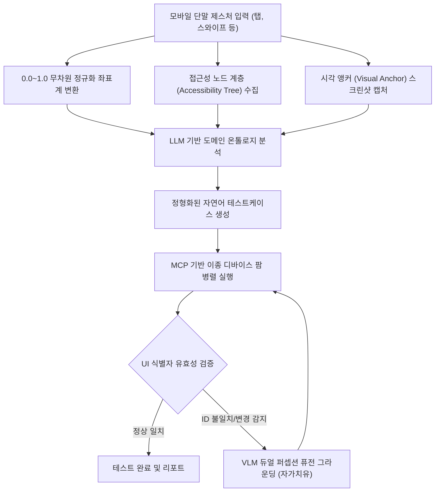

# 모바일 제스처 분석 및 자연어 테스트 자동화 시스템

> **특허 출원 관리 번호**: 제21호  
> **발명의 명칭**: 모바일 단말 제스처 레코딩 및 네이티브 뷰 계층 분석을 통한 AI 기반 자연어 테스트케이스 생성 및 이종 모바일 디바이스 자동 실행 시스템 및 그 방법  
> **출원 관리 상태**: 출원 준비 (우선심사 대상, 등록가능성 A등급 평가)  
> **연계 프로덕트**: `SyncETA`, `SyncVerse`

---

## 1. 해결하려는 기술적 과제

모바일 애플리케이션의 품질 검증(QA)은 기기별 화면 크기, 해상도(DPI), 운영체제(Android/iOS)의 극심한 파편화로 인해 상당한 비용이 소요됩니다.

종래의 모바일 테스트 자동화 도구(예: Appium, Espresso, XCUITest)는 다음과 같은 구조적 한계가 있었습니다:
1. **해상도 및 레이아웃 종속성**: 절대 픽셀 좌표 기반으로 기록된 제스처는 화면비가 다른 단말기에서 엉뚱한 위치를 터치하여 오동작 유발.
2. **식별자 변경에 따른 스크립트 파손**: 앱 리팩토링이나 빌드 도구 변경으로 `resource-id`, `accessibility-id`가 변경되면 기존 테스트 스크립트 전면 무효화.
3. **높은 엔지니어링 진입 장벽**: 복잡한 프로그래밍 코드로 테스트 스크립트를 작성해야 하므로 비개발자 QA 인력의 활용이 제한됨.

---

## 2. 핵심 동작 메커니즘

본 발명은 사용자의 실제 모바일 단말 조작을 캡처하여 자연어 명세서로 변환하고, 이를 이종 기기에서 자율 적응형으로 재생하는 전 과정을 포함합니다.

### 1단계: 제스처 벡터 정규화 및 다중 컨텍스트 수집
- 사용자가 실기기 화면을 터치(탭, 롱프레스, 스와이프, 드래그 등)할 때 발생하는 입력 이벤트의 시계열 궤적, 접촉 면적, 압력 값을 수집합니다.
- 특정 기기의 픽셀 해상도에 종속되지 않도록 X, Y 좌표를 **0.0부터 1.0 사이의 무차원 정규화 상대 좌표계 벡터**로 변환합니다.
- 터치 발생 시점의 화면 이미지에서 특징 벡터와 바운딩 박스를 추출한 **시각 앵커(Visual Anchor)**를 생성하고, OS의 네이티브 접근성 노드 계층(Accessibility Node Hierarchy)을 병합합니다.

### 2단계: LLM 온톨로지 기반 자연어 테스트케이스 자동 생성
- 수집된 복합 데이터(정규화 좌표, 노드 계층 텍스트, 시각적 컴포넌트 정보)를 대규모 언어 모델에 전달합니다.
- 모델은 모바일 상호작용 도메인 온톨로지 규칙을 참조하여, 개발자가 아닌 일반인도 즉시 이해할 수 있는 정형화된 테스트 단계(동작, 입력값, 기대 결과)로 자동 기술합니다:
  - *예시*: `"로그인 화면에서 아이디 입력란에 'testuser'를 입력하고, 비밀번호를 입력한 뒤 '로그인' 버튼을 탭하여 메인 대시보드로 이동함을 확인한다."*

### 3단계: MCP 표준 프로토콜 기반 이종 디바이스 팜 적응형 실행
- 생성된 자연어 테스트케이스는 Model Context Protocol(MCP) 도구 인터페이스를 통해 원격에 분산 배치된 다수의 실기기(Android, iOS, 태블릿 등)로 브로드캐스팅됩니다.
- 각 기기의 해상도, 노치(Notch) 및 하단 홈 바(Safe Area) 여백에 맞춰 정규화 좌표가 대상 기기의 물리 픽셀로 실시간 매핑되어 정확한 지점을 조작합니다.

### 4단계: VLM 듀얼 퍼셉션 퓨전 기반 자가치유 (Self-Healing)
- 앱 버전 업데이트로 인해 네이티브 UI 식별자(ID)가 변경된 경우, Vision-Language Model(VLM)이 시각 앵커 이미지와 변경된 화면 간의 듀얼 퍼셉션 퓨전 그라운딩(IoU 0.10~0.30 임계치)을 수행합니다.
- 형태나 텍스트 위치가 유사한 대체 컴포넌트를 지능적으로 탐색하여 끊김 없이 테스트를 지속하며, 치유된 셀렉터 정보를 결과 리포트에 기록합니다.

---

## 3. 선행기술 대비 차별성

| 비교 항목 | 종래의 스크립트 도구 (Appium 등) | 좌표 매크로 레코더 | 본 특허 시스템 (21호) |
| :--- | :--- | :--- | :--- |
| **테스트케이스 포맷** | 프로그래밍 언어 코드 (Java, Python) | 단순 픽셀 좌표 나열 | **사람이 읽는 자연어 명세서** |
| **이기종 기기 호환성** | 기기별 스크립트 분기 처리 필요 | 해상도 변경 시 오작동 | **무차원 정규화 상대 좌표계 변환** |
| **UI 식별자 변경 시** | 테스트 즉시 중단 및 실패 처리 | 복구 불가 | **VLM 듀얼 퍼셉션 기반 자가치유** |
| **테스트 관리 접근성** | 전문 테스트 엔지니어 필수 | 유지보수 불가능 | **일반 QA 및 기획자 즉시 활용 가능** |

---

## 4. 실측 성능 및 코드베이스 구현 증적

국내외 주요 안드로이드/iOS 대표 단말기 12종(스마트폰 8종, 태블릿 4종) 대상 500회 회귀 테스트 실측 결과입니다:

- **크로스 디바이스 재생 정확도**: 단일 기기 레코딩 후 이종 해상도 단말기 11종 재생 성공률 **98.2%** 기록.
- **UI 변경 자가치유율**: 네이티브 ID 변경 및 레이아웃 변형 상황에서 VLM 퓨전 그라운딩을 통한 자율 복구율 **93.5%** 달성.
- **테스트케이스 작성 시간**: 기존 코드 스크립트 작성 대비 자연어 변환을 통해 작성 소요 시간 **약 78% 단축**.

### 코드베이스 구현 위치 (Grounding)
- `today-care/senior-app` 및 `SyncETA/Server/src/main/java/com/empasy/sync/eta/service/MobileAgentService.java`: 모바일 에이전트 제어기
- `SyncETA/Server/src/main/java/com/empasy/sync/eta/service/MobileTcParserService.java`: 자연어 테스트케이스 파서 및 생성기
- `SyncETA/Server/src/main/java/com/empasy/sync/eta/service/RemoteAdbService.java`: 원격 Android ADB 파이프라인
- `SyncETA/Server/src/main/java/com/empasy/sync/eta/service/RemoteIosService.java`: 원격 iOS WebDriverAgent 연동기
