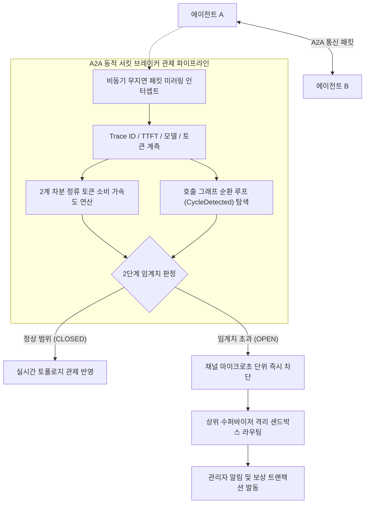

# 분산 멀티에이전트 A2A 텔레메트리 및 동적 서킷 브레이커

> **특허 출원 관리 번호**: 제22호  
> **발명의 명칭**: 분산 멀티 에이전트 통신 텔레메트리 분산 추적 및 토큰 폭주 연쇄 차단용 A2A 동적 서킷 브레이커 기반 통합 관제 시스템 및 방법  
> **출원 관리 상태**: 출원 준비 (우선심사 대상, 등록가능성 A등급 평가)  
> **연계 프로덕트**: `SyncVerse`

---

## 1. 해결하려는 기술적 과제

복수의 AI 에이전트가 상호 질의하고 작업을 위임하는 에이전트 간(A2A, Agent-to-Agent) 통신 환경에서는 전통적인 마이크로서비스와 다른 고유한 장애 양상이 나타납니다:

1. **정상 HTTP 200으로 위장된 토큰 폭주**:
   - HTTP 통신 자체는 성공 코드(200 OK)를 반환하지만, 에이전트 간 프롬프트 불일치나 환각으로 인해 질문과 재질의가 무한 루프를 돌며 분당 수백만 토큰을 소모하는 비용 폭주 사고가 발생합니다.
2. **연쇄 마비 전파**:
   - 한 에이전트의 지연 또는 잘못된 출력이 협업 파이프라인의 후속 에이전트들로 전파되어 전체 비즈니스 프로세스가 중단됩니다.
3. **기존 APM/서킷 브레이커의 한계**:
   - Netflix Hystrix나 Resilience4j와 같은 종래의 서킷 브레이커는 단순 네트워크 타임아웃이나 HTTP 5xx 에러율에 의존하므로, 의미론적인 대화 루프와 급격한 토큰 가속도를 감지하지 못합니다.

---

## 2. 핵심 동작 메커니즘

본 발명은 패킷 계측 지연 없이 에이전트 간 트래픽을 관측하고, 다차원 지표를 종합하여 비정상 세션을 실시간 격리합니다.

### 1단계: 비동기 무지연 패킷 미러링 인터셉트
- 에이전트 간 주고받는 메시지 페이로드를 네트워크 병목 없이 복제(Mirroring)하여 백그라운드 텔레메트리 버스로 전달합니다.
- 각 패킷에서 분산 추적용 상관 식별자(Trace ID, Span ID), 첫 토큰 생성 지연시간(TTFT: Time To First Token), 모델 식별자, 프롬프트/컴플리션 토큰 수량 및 호출된 도구 명세를 추출합니다.

### 2단계: 정류 토큰 소비 가속도 및 순환 루프 실시간 산출
- 슬라이딩 타임 윈도우 내에서 지수 가중 이동 평균(EMA)으로 평활화된 시계열 토큰 소비량을 2계 차분(Second-order Difference)하여 가속도 값을 도출합니다.
- 토큰 소비 속도가 급증하는 구간만을 선별하기 위해 음수 변화량을 0으로 클리핑하는 **정류 토큰 소비 가속도($a^+(t)$)**를 연산합니다.
- 동시에 에이전트 간 호출 그래프의 인접 행렬을 실시간 분석하여 동일 세션 내에서 A ➔ B ➔ C ➔ A 형태로 순환 호출되는 루프($CycleDetected$)를 검출합니다.

### 3단계: 2단계 하이브리드 리밋 제어
시스템은 과도한 오탐을 방지하면서 비용 누출을 막기 위해 2단계 차단 기준을 결합 적용합니다:
1. **1계층 하드 리밋(Hard Limit)**:
   - 단일 작업 세션 내 에이전트 간 위임 홉 수 15회 초과 또는 동일 에이전트 3회 연속 도구 실행 실패 시 무조건 차단.
2. **2계층 소프트 리밋(Soft Limit)**:
   - 토큰 가속도, 순환 루프 여부, 지연시간 편차를 가중 합산한 **복합 위험 지수가 0.75에 도달**하는 즉시 채널을 차단(`OPEN` 상태 전환).

### 4단계: 격리 샌드박스 라우팅 및 보상 트랜잭션
- 서킷이 열린 채널의 후속 메시지는 즉시 거절되며, 진행 중이던 트래픽은 **상위 수퍼바이저 중재용 격리 샌드박스**로 자동 리다이렉트됩니다.
- 수퍼바이저 에이전트는 이미 수행된 부분 작업에 대해 Saga 패턴 기반의 롤백 보상 트랜잭션을 트리거하고, 운영 콘솔에 해당 에이전트 노드를 위험 상태로 표기합니다.

---

## 3. 선행기술 대비 차별성

| 비교 항목 | 종래의 서킷 브레이커 (Resilience4j 등) | 단순 토큰 총량 제한 (Rate Limiting) | 본 특허 시스템 (22호) |
| :--- | :--- | :--- | :--- |
| **감지 대상** | HTTP 상태 코드 (5xx 에러, 타임아웃) | 분당/일당 정적 호출 횟수 | **의미론적 대화 루프 및 토큰 소비 가속도** |
| **정상 응답 위장 차단** | 감지 불가 (HTTP 200 반환 시 정상 간주) | 한도 도달 전까지 비용 누출 | **정류 가속도 기반 조기 선제 차단** |
| **복구 절차** | 단순 재시도(Retry) | 사용량 리셋 대기 | **상위 수퍼바이저 격리 및 Saga 롤백** |
| **관제 가시성** | 단순 지연시간/에러율 메트릭 | 누적 카운터 | **A2A 호출 그래프 및 실시간 서킷 토폴로지** |

---

## 4. 실측 성능 및 코드베이스 구현 증적

대규모 분산 에이전트 시뮬레이션 환경(에이전트 20개 노드, 동시 협업 세션 100건, 의도적 무한 루프 주입 테스트) 실측 결과입니다:

- **차단 반응 속도**: 이상 토큰 가속도 감지 후 채널 차단 완료까지 **평균 1.8밀리초** 이내 완료.
- **불필요한 API 비용 방어율**: 방치 시 세션당 평균 45,000토큰이 누출되던 시나리오에서 조기 차단을 통해 **낭비 토큰 94.2% 절감**.
- **미러링 계측 오버헤드**: 패킷 인터셉트로 인한 실제 A2A 통신 지연 증가율 **0.3% 미만**으로 무시할 수 있는 수준 기록.

### 코드베이스 구현 위치 (Grounding)
- `sync-verse/Server/src/main/java/com/empasy/sync/verse/controller/A2ACircuitBreakerController.java`: 서킷 제어 컨트롤러
- `sync-verse/Server/src/main/java/com/empasy/sync/verse/controller/AgentStreamSseController.java`: 실시간 텔레메트리 SSE 파이프라인
- `sync-verse/admin/src/views/admin/orchestration/A2aMessageTracer.vue`: A2A 분산 메시지 트레이서 UI
- `sync-verse/admin/src/views/admin/orchestration/AgentTopologyGraph.vue`: 3차원/2차원 에이전트 토폴로지 관제 뷰
