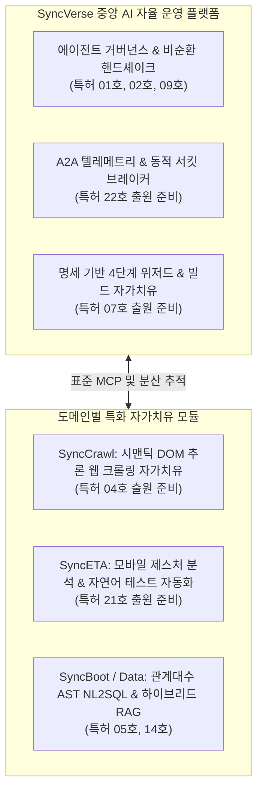

# SyncSeries 원천기술 특허 포트폴리오

## 1. 지식재산권(IP) 포트폴리오 개요

SyncSeries는 분산 멀티 에이전트 환경에서 발생하는 신뢰성 결함(가짜 정상, 환각 연쇄, 런타임 셀렉터 파손, 토큰 폭주 등)을 공학적으로 해결하기 위해 체계적인 지식재산권(IP) 보호망을 구축하고 있습니다.

인공지능 소프트웨어 기술에 대한 주요국 특허청(KIPO, USPTO, EPO)의 엄격한 심사 기준(예: 미국 특허법 제101조 Alice 테스트, 대한민국 특허법 제29조 소프트웨어 성립성)에 부합하도록, 단순 알고리즘이나 아이디어 차원의 추상적 개념을 배제하고 **물리적 프로세서, 메모리 구조, 분산 네트워크 계측 파이프라인과 결합된 구체적인 하드웨어 실시 형태**를 청구 범위로 명문화하였습니다.

---

## 2. 권리망 아키텍처: 4-Way Quad-Category 체계

SyncSeries의 특허 명세서는 클라우드 SaaS 배포 환경 및 분산 마이크로서비스 운영 환경에서 발생할 수 있는 특허 침해 행위에 대해 실효적인 권리 행사가 가능하도록 4가지 법정 범주의 독립 청구항을 일괄 구성하고 있습니다.

| 청구항 범주 | 구성 요건 및 권리 보호 범위 | 법적 의의 |
| :--- | :--- | :--- |
| **시스템 독립항** (Hardware System) | 물리적 프로세서, 메모리, 인터페이스 제어부 및 파이프라인 연산 장치의 결합 구조 | 온프레미스 하드웨어 서버 구축 및 어플라이언스 형태의 침해 대응 |
| **방법 독립항** (Method Pipeline) | 데이터 수신, 특징 벡터 정규화, 상태 전이, 폴백 실행까지의 시계열적 처리 단계 | 시스템 운용 프로세스 및 데이터 파이프라인 레벨의 침해 대응 |
| **저장매체 독립항** (CRM) | 컴퓨터 판독 가능한 비일시적 기록 매체에 저장된 명령어 시퀀스 | 패키지 소프트웨어 및 펌웨어 형태의 유통에 대한 직접 침해 주장 |
| **컴퓨터프로그램 독립항** (Direct Program) | 통신망을 통해 전송되거나 다운로드되는 프로그램 자체 | 클라우드 API 서비스(SaaS) 및 온라인 컨테이너 이미지 배포 침해 직접 공격 |

---

## 3. 선행기술 심사 기준 대응 전략

소프트웨어 관련 발명의 심사 과정에서 빈번하게 발생하는 거절 이유(진보성 결여, 기재불비, 발명의 불성립)를 선제적으로 방어하기 위해 다음과 같은 설계 원칙을 적용하였습니다.

1. **실제 Git 코드베이스 1:1 매핑 (Grounding Proof)**
   - 가공의 인터페이스나 실재하지 않는 추상 개념을 배제하고, 실제 리포지토리(`SyncVerse`, `SyncCrawl`, `SyncBoot`, `SyncETA`)에 구현된 서비스 클래스, 메서드, 데이터 구조를 실시예의 명세서 도면 및 부호와 1:1로 일치시켰습니다.
2. **독립항 상위개념화(Genus) 및 다층 종속항(Species) 요새화**
   - 독립항은 특정 라이브러리(예: 특정 오픈소스 프레임워크)나 단일 프로토콜 명칭에 한정되지 않도록 기능적 상위개념으로 정의하여 경쟁사의 회피 설계를 차단하였습니다.
   - 종속항에는 임계적 의의를 가지는 수치 한정(예: 토큰 차분 가속도 임계치, IoU 매칭 범위, 윈도우 크기 등)과 단계별 폴백 로직을 다층 배치하여 진보성 심사에 대비하였습니다.
3. **외부 관측성(Black-Box Detectability) 확보**
   - 소스코드 직접 열람이 불가능한 외부 서버 환경에서도 네트워크 패킷 헤더, RFC 7807 표준 오류 페이로드, HTTP 응답 시계열 특성을 통해 침해 여부를 입증할 수 있도록 외부 관측 식별 요소를 청구항에 결합하였습니다.

---

## 4. 특허 관리 현황 및 로드맵

SyncSeries는 대한민국 특허청(KIPO) 정식 등록 완료된 원천 특허를 필두로, 도메인 자율운영의 핵심인 자가치유(Self-Healing) 및 관제 기술 4건에 대해 우선심사 신청 및 순차 출원을 진행하고 있습니다.

### 1) 정식 등록 완료 특허 (Registered Patent)
| 등록 번호 | 발명의 명칭 | 주요 연계 솔루션 | 법적 상태 |
| :---: | :--- | :--- | :---: |
| **제10-2025-0125736호** | [웹 브라우저 동작 레코딩을 통한 AI 기반 자연어 테스트케이스 생성 및 자동 실행 시스템 및 그 방법](./registered-web-action-recording.md) | `SyncETA` (웹 자율 QA), `SyncVerse` | **등록 완료** (2025-09-04 출원) |

### 2) 추가 출원 준비 특허 (Pending Patents - 우선심사 대상)
| 관리 번호 | 발명의 명칭 | 주요 연계 솔루션 | 출원 관리 상태 |
| :---: | :--- | :--- | :---: |
| **제04호** | [시맨틱 DOM 트리 추론 및 멀티모달 비전을 이용한 웹 크롤링 셀렉터 자가 치유(Self-Healing) 및 데이터 추출 시스템 및 방법](./04-semantic-dom-self-healing.md) | `SyncCrawl`, `SyncVerse` | **출원 준비 (우선심사 대상)** |
| **제07호** | [명세 기반 4단계 위저드 및 빌드 아티팩트 검증 피드백 루프를 이용한 소스코드 자율 변이 및 자가 치유(Self-Healing) 시스템 및 방법](./07-four-stage-wizard-build.md) | `SyncBoot`, `SyncVerse` | **출원 준비 (우선심사 대상)** |
| **제21호** | [모바일 단말 제스처 레코딩 및 네이티브 뷰 계층 분석을 통한 AI 기반 자연어 테스트케이스 생성 및 이종 모바일 디바이스 자동 실행 시스템 및 그 방법](./21-mobile-gesture-nlp.md) | `SyncETA` (모바일 QA), `SyncVerse` | **출원 준비 (우선심사 대상)** |
| **제22호** | [분산 멀티 에이전트 통신 텔레메트리 분산 추적 및 토큰 폭주 연쇄 차단용 A2A 동적 서킷 브레이커 기반 통합 관제 시스템 및 방법](./22-a2a-telemetry-circuit.md) | `SyncVerse` | **출원 준비 (우선심사 대상)** |
