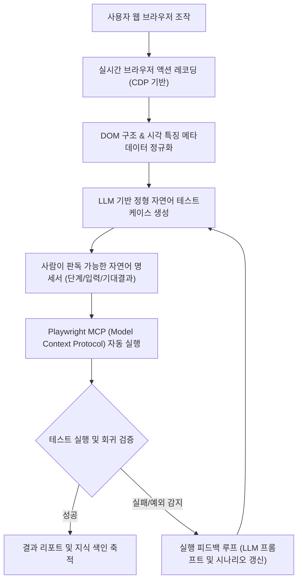

# 웹 브라우저 동작 레코딩 기반 AI 자연어 테스트케이스 자동화

> **특허 등록 번호**: 특허 제10-2025-0125736호  
> **발명의 명칭**: 웹 브라우저 동작 레코딩을 통한 AI 기반 자연어 테스트케이스 생성 및 자동 실행 시스템 및 그 방법  
> **출원일**: 2025년 09월 04일  
> **특허 법적 상태**: **대한민국 특허청(KIPO) 정식 등록 완료**  
> **주요 연계 솔루션**: `SyncETA` (웹 자율 QA 엔진), `SyncVerse`

---

## 1. 해결하려는 기술적 과제

현대 소프트웨어 개발 환경에서는 지속적 배포(CD: Continuous Deployment) 주기가 단축됨에 따라 빈번한 회귀 테스트(Regression Test) 수행이 필수적입니다. 그러나 기존의 테스트 자동화 도구(Selenium, 정적 스크립트 기반 도구)는 다음과 같은 구조적 한계가 있었습니다:

1. **높은 테스트 스크립트 작성 비용**:
   - 전문적인 프로그래밍 역량이 요구되어 비개발자 QA 인력이나 현업 기획자의 테스트 참여가 제한되었습니다.
2. **UI 변경에 따른 스크립트 파손**:
   - 프론트엔드 UI 클래스나 DOM 구조가 미세하게 변경되어도 기존 스크립트의 셀렉터가 깨져 대규모 수동 수정 공수가 지속적으로 발생하였습니다.
3. **테스트케이스 관리의 가독성 부재**:
   - 코드로 작성된 테스트 스크립트는 비즈니스 기획서와의 정합성을 한눈에 검증하기 어려워 테스트 자산의 문서화 및 이력 관리가 분리되는 사일로(Silo) 문제가 있었습니다.

---

## 2. 핵심 동작 메커니즘

본 등록 특허는 사용자가 웹 브라우저에서 수행하는 일상적인 조작을 캡처하여 자연어 명세서로 변환하고, 이를 표준 도구 프로토콜(Playwright MCP)을 통해 자율적으로 재실행하는 전주기 파이프라인을 포함합니다.

### 1단계: 실시간 브라우저 동작 레코딩
- Chrome DevTools Protocol(CDP) 세션을 활용하여 마우스 클릭, 텍스트 타이핑, 스크롤, 드롭다운 선택, 페이지 내비게이션 등의 시계열 이벤트를 지연 없이 캡처합니다.
- 단순 이벤트 좌표뿐만 아니라, 이벤트가 발생한 DOM 노드의 계층 구조, 텍스트 내용, 주변 시각적 요소(라벨, 인접 텍스트 등)를 함께 정규화합니다.

### 2단계: LLM 기반 자연어 테스트케이스 자동 생성
- 수집된 동작 데이터를 대규모 언어 모델(LLM)에 전달하여, 프로그래밍 코드가 아닌 정형화된 자연어 테스트케이스 형태로 자동 변환합니다.
- 생성된 문서는 명확한 3단 구조(테스트 단계, 입력 데이터, 검증 기대 결과)를 지니며, 일반 기획자나 관리자가 즉시 검토할 수 있는 표준 문서 양식을 갖춥니다.

### 3단계: Playwright MCP 기반 자동 실행
- 변환된 자연어 테스트케이스는 Model Context Protocol(MCP) 규격을 따르는 Playwright 실행 에이전트로 전달됩니다.
- 에이전트는 자연어 지시문을 분석하여 웹 브라우저의 DOM 요소와 상호작용하고, 다중 브라우저(Chrome, Edge, Firefox, WebKit) 환경에서 시나리오를 자동 실행합니다.

### 4단계: 지속적 품질 개선 피드백 루프
- 테스트 실행 결과와 실패 로그, 화면 스냅샷을 수집하여 LLM의 프롬프트 및 컨텍스트 메모리에 피드백합니다.
- 동일한 UI 패턴에 대해 더 강건하고 유지보수성이 높은 테스트케이스가 생성되도록 모델의 생성 규칙을 지속적으로 고도화합니다.

---

## 3. 선행기술 대비 정량적 차별성

| 비교 항목 | 종래의 스크립트 도구 (Selenium 등) | 정적 레코더 도구 | 본 등록 특허 (제10-2025-0125736호) |
| :--- | :--- | :--- | :--- |
| **테스트 표현 형식** | Java/Python 프로그래밍 코드 | 단순 좌표 또는 취약한 XPath 나열 | **사람이 읽는 정형 자연어 명세서** |
| **작성 난이도** | 전문 개발 역량 필수 | 조작은 쉬우나 유지보수 불가 | **일반 사용자 조작 기반 자동 생성** |
| **실행 엔진 연동** | 고정된 전용 드라이버 | 독자적 매크로 엔진 | **표준 Playwright MCP 프로토콜 기반** |
| **품질 진화 체계** | 수동 코드 수정 | 정적 실행 반복 | **실행 피드백 기반 LLM 생성 품질 지속 개선** |

---

## 4. 모바일 특허와의 연계 및 풀스택 자율 QA 체계

본 등록 특허는 데스크톱 웹 환경을 전담하며, 추가 출원 준비 중인 **특허 제21호(모바일 제스처 레코딩 및 AI 자연어 테스트케이스 자동화)**와 결합하여 `SyncETA`의 '웹 + 모바일' 통합 자율 QA 포트폴리오를 완성합니다.

- **웹 영역 (등록 특허)**: CDP 기반 브라우저 액션 레코딩 ➔ Playwright MCP 자동 실행.
- **모바일 영역 (특허 21호)**: 터치 궤적 정규화 벡터 ➔ 이종 디바이스 팜(Android/iOS) 적응형 병렬 실행.
- 두 특허의 유기적 결합을 통해 기업은 단일 플랫폼 내에서 웹 포털부터 모바일 네이티브 앱까지 단일화된 자연어 체계로 품질 검증을 수행할 수 있습니다.
