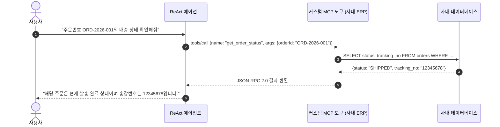

# 사내 시스템 연동 커스텀 MCP 도구 개발

## 1. 개요 및 MCP 표준 규격

**Model Context Protocol (MCP)**은 인공지능 에이전트가 외부 데이터 소스(데이터베이스, 사내 ERP, 배포 파이프라인 등)와 상호작용하기 위해 사용하는 개방형 JSON-RPC 2.0 통신 규격입니다.

SyncSeries에서는 사내 레거시 시스템의 기능을 에이전트가 이해할 수 있는 정형화된 JSON Schema 도구로 노출하고, 이를 에이전트가 필요에 따라 자율적으로 호출(Tool Calling)할 수 있도록 표준화된 어노테이션 기반 도구 등록 메커니즘을 제공합니다.



---

## 2. Java 기반 커스텀 도구 구현

`SyncSeries`의 백엔드 모듈은 `@Tool` 애너테이션을 통해 일반 Spring Bean 메서드를 즉시 MCP 도구로 등록할 수 있습니다.

### 1) 도구 클래스 정의 및 스키마 선언
```java
package com.empasy.sync.custom.tools;

import io.agentscope.core.tool.Tool;
import io.agentscope.core.tool.ToolParam;
import lombok.RequiredArgsConstructor;
import lombok.extern.slf4j.Slf4j;
import org.springframework.stereotype.Component;

@Slf4j
@Component
@RequiredArgsConstructor
public class OrderManagementTools {

    private final InternalOrderRepository orderRepository;

    @Tool(
        name = "get_order_status",
        description = "고객의 주문번호(orderId)를 기반으로 현재 주문 상태, 결제 금액, 택배 송장번호를 조회합니다."
    )
    public OrderStatusResult getOrderStatus(
        @ToolParam(name = "orderId", description = "조회할 주문 고유 식별자 (예: ORD-2026-001)", required = true)
        String orderId
    ) {
        log.info("[MCP Tool] get_order_status 호출 수신 - orderId: {}", orderId);

        // 1. 입력값 기본 유효성 검증
        if (orderId == null || !orderId.matches("^ORD-\\d{4}-\\d{3,}$")) {
            throw new IllegalArgumentException("유효하지 않은 주문번호 형식입니다.");
        }

        // 2. 내부 데이터베이스 조회
        return orderRepository.findByOrderId(orderId)
                .map(order -> OrderStatusResult.builder()
                        .orderId(order.getId())
                        .status(order.getStatus().name())
                        .amount(order.getTotalAmount())
                        .trackingNumber(order.getTrackingNumber())
                        .build())
                .orElseThrow(() -> new OrderNotFoundException("주문 정보를 찾을 수 없습니다: " + orderId));
    }
}
```

### 2) DTO 모델 설계 (Lombok 적용)
```java
package com.empasy.sync.custom.tools;

import lombok.Builder;
import lombok.Getter;

import java.math.BigDecimal;

@Getter
@Builder
public class OrderStatusResult {
    private String orderId;
    private String status;
    private BigDecimal amount;
    private String trackingNumber;
}
```

---

## 3. 입력값 검증 및 보안 가드레일 (RBAC)

에이전트가 호출하는 도구는 악의적이거나 비정상적인 파라미터가 유입될 수 있으므로, 반드시 엄격한 가드레일을 적용해야 합니다.

1. **JSON Schema 엄격 바인딩**:
   - 허용되지 않은 추가 필드(`additionalProperties: false`)는 자동 차단합니다.
   - 숫자 파라미터는 최소/최대 범위(`minimum`, `maximum`), 문자열은 정규식 패턴(`pattern`)을 명시합니다.
2. **역할 기반 인가 (Tool RBAC)**:
   - 데이터 삭제, 설정 변경 등 쓰기 권한이 필요한 도구는 세션의 사용자 권한을 검증합니다:
     ```java
     @Tool(name = "cancel_order", description = "주문을 취소하고 결제를 환불 처리합니다.")
     @PreAuthorize("hasRole('ROLE_SHOP_ADMIN')")
     public OrderCancelResult cancelOrder(...) { ... }
     ```

---

## 4. MCP JSON-RPC 통신 규격 확인

등록된 도구는 표준 MCP 클라이언트에 의해 다음과 같이 조회되고 실행됩니다.

### 도구 목록 조회 응답 (`tools/list`)
```json
{
  "jsonrpc": "2.0",
  "result": {
    "tools": [
      {
        "name": "get_order_status",
        "description": "고객의 주문번호(orderId)를 기반으로 현재 주문 상태를 조회합니다.",
        "inputSchema": {
          "type": "object",
          "properties": {
            "orderId": {
              "type": "string",
              "description": "조회할 주문 고유 식별자"
            }
          },
          "required": ["orderId"],
          "additionalProperties": false
        }
      }
    ]
  },
  "id": 1
}
```

### 도구 실행 요청 (`tools/call`)
```json
{
  "jsonrpc": "2.0",
  "method": "tools/call",
  "params": {
    "name": "get_order_status",
    "arguments": {
      "orderId": "ORD-2026-001"
    }
  },
  "id": 2
}
```
