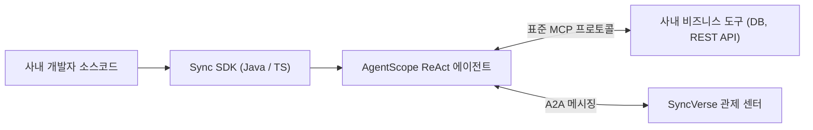

# Sync SDK 및 개발자 센터

## 1. 개요

SyncSeries 개발자 센터는 사내 엔지니어 및 파트너사 개발자가 기존 비즈니스 시스템(Spring Boot 백엔드, 사내 ERP/CRM 등)을 **표준 AI 에이전트 생태계로 손쉽게 통합하고 확장**할 수 있도록 표준 SDK와 가이드를 제공합니다.

SyncSeries의 에이전트는 프레임워크 전반에서 검증된 자바 기반의 `AgentScope Java`(`io.agentscope:agentscope-harness`) 및 Anthropic의 표준 인터페이스 규격인 **Model Context Protocol(MCP)**을 기반으로 개발됩니다.



### 핵심 개발 트랙 및 표준 문서 안내

개발자 센터의 실습 가이드 외에, 전사 표준 규격 및 공통 모듈 문서는 아래 링크에서 확인할 수 있습니다:

| 구분 | 주요 내용 | 문서 링크 |
|:---|:---|:---|
| **AgentScope Java 표준** | Spring Boot 환경에서 에이전트 협업 및 ReAct 구성 규칙 | [AgentScope 가이드 →](/ecosystem/agentscope-guide) |
| **표준 MCP 규격** | Model Context Protocol 도구 호출 사양 및 에러 처리 표준 | [MCP 프로토콜 규격 →](/ecosystem/mcp-protocol) |
| **공통 비즈니스 모듈** | 8대 공통 모듈(`sync-module-*`) 및 SDK 기본 설계 | [공유 모듈 & SDK →](/ecosystem/shared-modules-and-sdk) |
| **품질 검증 원칙** | 실제 인프라 연동 기반 4-Cycle 품질 검증 프로토콜 | [품질 하네스 원칙 →](/ecosystem/zero-mock-harness) |
| **운영 및 승인 관리** | 현업 승인(HITL) 및 토큰 예산 관리 콘솔 운영 가이드 | [운영 가이드 →](/guide/) |

---

## 2. 5분 퀵스타트 (Java / Spring Boot)

Spring Boot 3 환경에서 최소한의 설정으로 동작 가능한 첫 번째 AI 에이전트를 구성하는 표준 절차입니다.

### 1단계: Maven 의존성 추가
프로젝트의 `pom.xml` 파일에 SyncSeries SDK 코어 모듈을 추가합니다:

```xml
<dependency>
    <groupId>com.empasy.sync.sdk</groupId>
    <artifactId>sync-sdk-common</artifactId>
    <version>2026.10.0</version>
</dependency>
<dependency>
    <groupId>io.agentscope</groupId>
    <artifactId>agentscope-harness</artifactId>
    <version>1.0.4</version>
</dependency>
```

### 2단계: application.yml 에이전트 설정
로컬 또는 사내 LLM 게이트웨이 엔드포인트를 지정합니다:

```yaml
sync:
  ai:
    gateway-url: http://localhost:8000/v1
    model-name: Qwen2.5-32B-Instruct
    api-key: ${SYNC_AI_API_KEY:local-dev-key}
    temperature: 0.1
    timeout-ms: 30000
```

### 3단계: 첫 번째 ReAct 에이전트 빈(Bean) 등록
Lombok 애너테이션과 생성자 주입을 적용하여 에이전트를 생성합니다:

```java
package com.example.demo.agent;

import io.agentscope.core.agent.ReActAgent;
import io.agentscope.core.model.OpenAiChatModel;
import io.agentscope.core.tool.ToolRegistry;
import lombok.RequiredArgsConstructor;
import org.springframework.context.annotation.Bean;
import org.springframework.context.annotation.Configuration;

@Configuration
@RequiredArgsConstructor
public class SimpleAgentConfig {

    private final OpenAiChatModel chatModel;
    private final ToolRegistry toolRegistry;

    @Bean
    public ReActAgent customerSupportAgent() {
        return ReActAgent.builder()
                .name("CustomerSupportAgent")
                .sysPrompt("당신은 고객 지원 전담 에이전트입니다. 등록된 도구를 활용하여 사용자의 주문 상태를 조회하고 답변하십시오.")
                .model(chatModel)
                .toolRegistry(toolRegistry)
                .maxIterations(5)
                .build();
    }
}
```

### 4단계: 에이전트 실행 및 질의
컨트롤러 또는 서비스에서 에이전트를 호출하여 사용자 메시지를 전달합니다:

```java
package com.example.demo.controller;

import io.agentscope.core.agent.ReActAgent;
import io.agentscope.core.message.Msg;
import lombok.RequiredArgsConstructor;
import org.springframework.web.bind.annotation.*;

@RestController
@RequestMapping("/api/v1/support")
@RequiredArgsConstructor
public class SupportAgentController {

    private final ReActAgent customerSupportAgent;

    @PostMapping("/ask")
    public String askAgent(@RequestBody String userQuestion) {
        Msg response = customerSupportAgent.reply(Msg.ofUser("User", userQuestion));
        return response.getText();
    }
}
```

---

## 3. 개발자 가이드 목차

- **[사내 시스템 연동 커스텀 도구 개발 (MCP)](./custom-mcp-tool)**: 사내 REST API 및 RDB 쿼리를 표준 JSON-RPC 도구로 패키징하는 실무 튜토리얼.
- **[Sync SDK 인터페이스 명세](./sync-sdk-reference)**: `com.empasy.sync.sdk` 패키지의 주요 클래스 및 에러 처리 표준.
- **[실환경 기반 테스트 가이드 (Zero-Mock)](./zero-mock-testing)**: Mock 객체 없이 실제 컨테이너 환경에서 에이전트의 도구 호출 및 동작을 검증하는 가이드.
