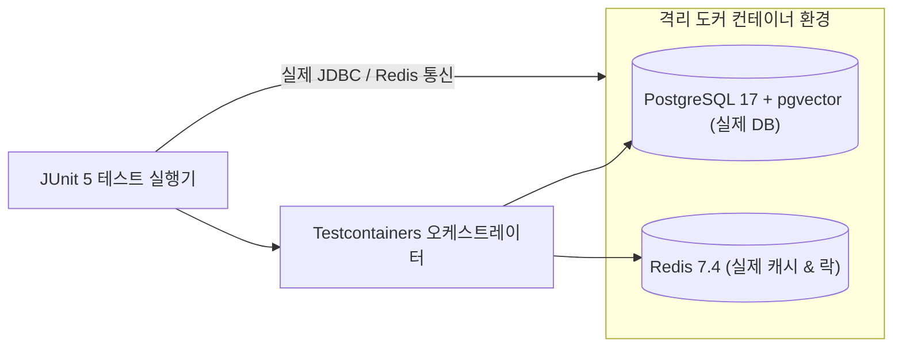

# Zero-Mock 테스트 환경 구성 및 에이전트 검증

## 1. Zero-Mock 테스트 원칙 및 배경

전통적인 단위 테스트에서 널리 쓰이는 가짜 객체(Mockito의 `when(...).thenReturn(...)` 등)는 인공지능 에이전트 시스템 검증에서 심각한 결함을 유발합니다:

1. **가짜 정상(Fake Fallback) 은폐**:
   - 실제 데이터베이스 제약 조건(Foreign Key, Unique Key, PostgreSQL 17 pgvector 인덱스 등)이나 네트워크 지연을 Mock 객체는 시뮬레이션하지 못하므로, 테스트는 통과하지만 운영 환경에서 즉각 크래시가 발생하는 위험이 상존합니다.
2. **비결정적 AI 동작 검증 부재**:
   - 에이전트가 생성한 동적 SQL 질의나 JSON 파라미터가 실제 데이터베이스 드라이버나 타깃 API에서 정상 파싱되는지 여부는 실제 인프라와의 통신 없이는 판별할 수 없습니다.

따라서 SyncSeries는 **Zero-Mock 원칙**을 강제합니다:
> *"모든 에이전트 및 도구 테스트는 가짜 Mock 객체를 일체 사용하지 않으며, Docker 기반 Testcontainers로 구동된 실제 PostgreSQL 17, Redis, MinIO 인프라 상에서 실측 검증한다."*



---

## 2. Testcontainers 기반 통합 테스트 베이스 클래스

모든 통합 테스트는 재사용 가능한 공통 추상 클래스를 상속받아 컨테이너 기동 오버헤드를 최소화(Singleton Container Pattern)합니다.

```java
package com.empasy.sync.test.base;

import org.springframework.boot.test.context.SpringBootTest;
import org.springframework.test.context.ActiveProfiles;
import org.springframework.test.context.DynamicPropertyRegistry;
import org.springframework.test.context.DynamicPropertySource;
import org.testcontainers.containers.GenericContainer;
import org.testcontainers.containers.PostgreSQLContainer;
import org.testcontainers.junit.jupiter.Testcontainers;
import org.testcontainers.utility.DockerImageName;

@SpringBootTest(webEnvironment = SpringBootTest.WebEnvironment.RANDOM_PORT)
@ActiveProfiles("test")
@Testcontainers
public abstract class AbstractZeroMockIntegrationTest {

    // 1. PostgreSQL 17 pgvector 실제 이미지 구동
    static final PostgreSQLContainer<?> postgres = new PostgreSQLContainer<>(
            DockerImageName.parse("pgvector/pgvector:pg17")
    )
            .withDatabaseName("sync_test_db")
            .withUsername("test_user")
            .withPassword("test_pass")
            .withReuse(true);

    // 2. Redis 실제 이미지 구동
    static final GenericContainer<?> redis = new GenericContainer<>(
            DockerImageName.parse("redis:7.4-alpine")
    )
            .withExposedPorts(6379)
            .withReuse(true);

    static {
        postgres.start();
        redis.start();
    }

    // 3. Spring Boot 데이터소스 동적 바인딩
    @DynamicPropertySource
    static void configureProperties(DynamicPropertyRegistry registry) {
        registry.add("spring.datasource.url", postgres::getJdbcUrl);
        registry.add("spring.datasource.username", postgres::getUsername);
        registry.add("spring.datasource.password", postgres::getPassword);
        registry.add("spring.data.redis.host", redis::getHost);
        registry.add("spring.data.redis.port", () -> redis.getMappedPort(6379));
    }
}
```

---

## 3. 실전 에이전트 도구 검증 테스트 코드 예제

실제 데이터베이스에 테스트 픽스처 데이터를 삽입하고, 에이전트의 도구 실행 메서드를 직접 호출하여 결과 정합성을 단언(Assert)합니다.

```java
package com.empasy.sync.shop.tool;

import com.empasy.sync.custom.tools.OrderManagementTools;
import com.empasy.sync.custom.tools.OrderStatusResult;
import com.empasy.sync.test.base.AbstractZeroMockIntegrationTest;
import org.junit.jupiter.api.DisplayName;
import org.junit.jupiter.api.Test;
import org.springframework.beans.factory.annotation.Autowired;
import org.springframework.jdbc.core.JdbcTemplate;
import org.springframework.transaction.annotation.Transactional;

import java.math.BigDecimal;

import static org.assertj.core.api.Assertions.assertThat;
import static org.assertj.core.api.Assertions.assertThatThrownBy;

@Transactional
class OrderManagementToolsZeroMockTest extends AbstractZeroMockIntegrationTest {

    @Autowired
    private OrderManagementTools orderTools;

    @Autowired
    private JdbcTemplate jdbcTemplate;

    @Test
    @DisplayName("실제 DB 픽스처 기반 get_order_status 도구 정상 조회 검증")
    void testGetOrderStatusSuccess() {
        // Given: 실제 격리 DB에 주문 데이터 삽입
        jdbcTemplate.update(
            "INSERT INTO orders (id, status, total_amount, tracking_number) VALUES (?, ?, ?, ?)",
            "ORD-2026-001", "SHIPPED", new BigDecimal("125000.00"), "TRACK-98765"
        );

        // When: MCP 도구 메서드 직접 실행 (No Mocking)
        OrderStatusResult result = orderTools.getOrderStatus("ORD-2026-001");

        // Then: 실제 쿼리 결과 및 데이터 정합성 검증
        assertThat(result).isNotNull();
        assertThat(result.getOrderId()).isEqualTo("ORD-2026-001");
        assertThat(result.getStatus()).isEqualTo("SHIPPED");
        assertThat(result.getAmount()).isEqualByComparingTo("125000.00");
        assertThat(result.getTrackingNumber()).isEqualTo("TRACK-98765");
    }

    @Test
    @DisplayName("잘못된 형식의 주문번호 입력 시 예외 발생 검증")
    void testInvalidOrderIdFormat() {
        assertThatThrownBy(() -> orderTools.getOrderStatus("INVALID_FORMAT"))
                .isInstanceOf(IllegalArgumentException.class)
                .hasMessageContaining("유효하지 않은 주문번호 형식입니다");
    }
}
```

---

## 4. CI/CD 환경에서의 실행 성능 최적화

Testcontainers는 매 테스트 메서드마다 컨테이너를 새로 띄우지 않고, JVM 프로세스 생명주기 동안 단 1회만 기동하고 재사용(`.withReuse(true)`)하도록 설정되어 있습니다.

- **컨테이너 기동 시간**: 최초 기동 시 약 3~5초 소요.
- **후속 테스트 실행**: 메모리 상에서 즉시 실행되므로 일반 Mock 테스트 대비 총 실행 시간 증가폭이 10% 미만으로 억제됩니다.
- **결과 무결성**: 가짜 객체로 인한 착시를 배제하고, 실제 SQL 문법, 트랜잭션 격리 수준, 스키마 유효성을 실제 런타임 환경 기준으로 정밀하게 검증합니다.
