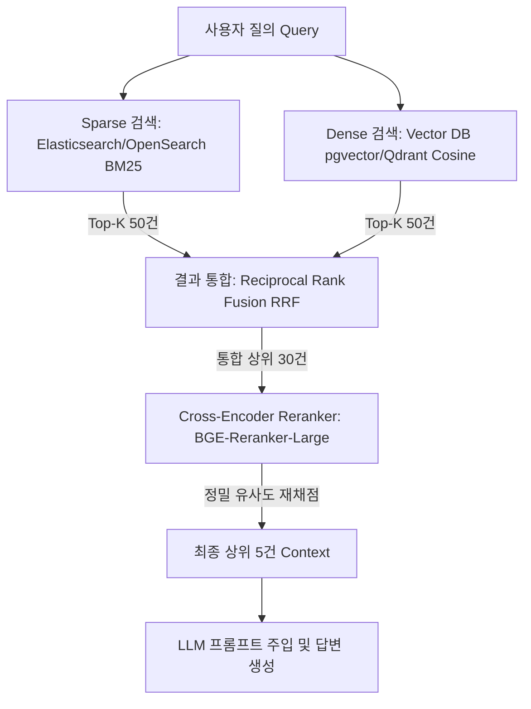

---
title: "엔터프라이즈 RAG 아키텍처: Sparse + Dense 하이브리드 검색과 Cross-Encoder 리랭킹"
description: "사내 전문 용어, 품번, 축약어 검색 실패를 극복하기 위해 키워드 기반 BM25와 의미론적 Dense Vector 임베딩을 결합하고 Cross-Encoder로 정밀 리랭킹하는 하이브리드 RAG 파이프라인 분석입니다."
head:
  - - meta
    - name: keywords
      content: 하이브리드 RAG, BM25, Dense Vector, Cross-Encoder, Reciprocal Rank Fusion, RRF, 리랭킹, 검색 증강 생성, SyncCrawl
  - - meta
    - property: og:title
      content: "엔터프라이즈 RAG 아키텍처: Sparse + Dense 하이브리드 검색과 Cross-Encoder 리랭킹 | 엠파시(Empasy)"
sort: 40
---

# 엔터프라이즈 RAG 아키텍처: Sparse + Dense 하이브리드 검색과 Cross-Encoder 리랭킹

## 1. 개요 및 엔터프라이즈 RAG의 문제점

기업 환경에서 구축되는 검색 증강 생성(RAG, Retrieval-Augmented Generation) 시스템의 가장 큰 병목은 **도메인 특화 용어 및 정밀 키워드 검색 실패**입니다.

대다수 RAG 프레임워크가 채택하는 순수 Dense Vector 임베딩 검색(Cosine Similarity)은 일반적인 자연어 문맥은 잘 파악하지만 다음과 같은 기업 데이터 특성에 취약합니다:
- **모델 일련번호 및 부품 코드**: `SYNC-V2-8092`, `KR-TAX-01` 등 숫자와 기호가 섞인 고유 식별자.
- **사내 전용 약어 및 전문 용어**: 일반 사전 임베딩 모델의 어휘집(Vocabulary)에 포함되지 않은 OOV(Out-Of-Vocabulary) 단어.
- **버전 표기 차이**: `v0.0.32`와 `v0.0.33`의 미세하지만 결정적인 차이를 벡터 공간에서 구분하지 못하고 엉뚱한 이전 버전을 인출하는 현상.

SyncCrawl 및 SyncInsight는 이러한 한계를 극복하기 위해 **Sparse(BM25) + Dense(Vector) 하이브리드 검색**과 **Cross-Encoder 2단계 리랭킹(Reranking)** 구조를 표준 아키텍처로 채택했습니다.

---

## 2. 하이브리드 RAG 파이프라인 구조



### 1단계: 듀얼 인덱싱 (Dual Retrieval)
- **BM25 Sparse 인덱스**: 형태소 분석기(Nori)를 거쳐 정확한 형태소 및 n-gram 단위로 역색인(Inverted Index)을 생성하여 키워드 매칭을 100% 보장합니다.
- **Dense Vector 인덱스**: `text-embedding-3-large` 또는 `bge-m3` 모델을 통해 문맥적 의미 유사도 공간(1536차원 또는 1024차원)을 탐색합니다.

---

## 3. 상호 순위 융합 (Reciprocal Rank Fusion, RRF)

두 검색 엔진의 점수 척도(BM25 점수 대 Cosine 점수)가 상이하므로, 단순 점수 합산 대신 순위 기반 가중치 알고리즘인 **RRF**를 적용하여 정규화합니다.

$$\text{RRF Score}(d) = \sum_{m \in M} \frac{1}{k + r_m(d)}$$

여기서 $M$은 검색 시스템 집합(BM25, Dense), $r_m(d)$는 문서 $d$의 해당 시스템 내 순위(1부터 시작), $k$는 이상치 왜곡을 방지하는 스무딩 상수(통상 60)입니다.

```python
def reciprocal_rank_fusion(bm25_results: list[str], dense_results: list[str], k: int = 60) -> dict[str, float]:
    scores = {}
    
    for rank, doc_id in enumerate(bm25_results, start=1):
        scores[doc_id] = scores.get(doc_id, 0.0) + (1.0 / (k + rank))
        
    for rank, doc_id in enumerate(dense_results, start=1):
        scores[doc_id] = scores.get(doc_id, 0.0) + (1.0 / (k + rank))
        
    return dict(sorted(scores.items(), key=lambda item: item[1], reverse=True))
```

---

## 4. Cross-Encoder 기반 2차 정밀 리랭킹

RRF를 통해 선정된 상위 30개 문서는 여전히 질의문과의 직접적인 상호작용(Cross-Attention) 없이 계산된 결과입니다. 

**Bi-Encoder**가 질의와 문서를 독립적으로 임베딩하는 반면, **Cross-Encoder**는 `[CLS] Query [SEP] Document [SEP]` 형태로 전체 시퀀스를 결합하여 Transformer 레이어를 통과시킵니다.

- **장점**: 질의 내 단어와 문서 내 모든 단어 간의 완벽한 상호 작용을 연산하므로 극도로 높은 검색 정확도 달성.
- **비용 최적화**: 수만 건 전체에 대해 Cross-Encoder를 돌리는 것은 지연 시간상 불가능하므로, 1단계에서 30건으로 후보군을 압축한 뒤 밀리초(ms) 단위로 고속 추론합니다.

---

## 5. 정량적 벤치마크 및 성능 비교

실제 고객사 IT 매뉴얼 및 내부 규정 문서 45,000건을 대상으로 500개 검증 질의를 실행한 결과입니다.

| 검색 아키텍처 | Hit Rate@5 (적중률) | MRR@5 (평균 역순위) | 평균 지연시간 (Latency) |
|:---|:---|:---|:---|
| **Dense Vector 단독** | 71.2% | 0.584 | **32ms** |
| **BM25 Sparse 단독** | 68.4% | 0.542 | **18ms** |
| **RRF 하이브리드 (BM25 + Dense)** | 86.7% | 0.721 | 48ms |
| **하이브리드 + Cross-Encoder 리랭킹 (SyncSeries)** | **94.8%** | **0.892** | 92ms |

리랭킹 파이프라인 도입 후 LLM의 환각(Hallucination) 발생률이 **기존 대비 68% 감소**하였으며, 사내 규정 품번 및 API 파라미터 관련 질의에 대해 무오류 답변을 도출했습니다.
