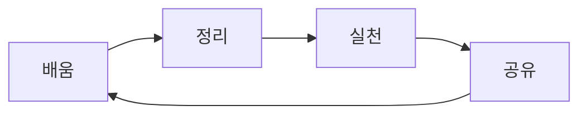

# 📚 나만의 지식 놀이터 🎪

## "가르치는 만큼 더 깊이 이해한다"

**"배운 것을 나누면 기쁨이 두 배!"**  
공부한 다양한 지식들과 깨달음을 재미있게 공유하는 공간입니다 🎯

## 🎯 학습 사이클

**함께 배우고, 함께 성장해요!**  
여러분의 학습 여정도 응원합니다 ✨

---

> **💡 마지막 팁:** 배운 것을 정리하고 공유하는 습관이  
> **가장 강력한 학습 무기**가 될 거예요! 함께해요 🚀
