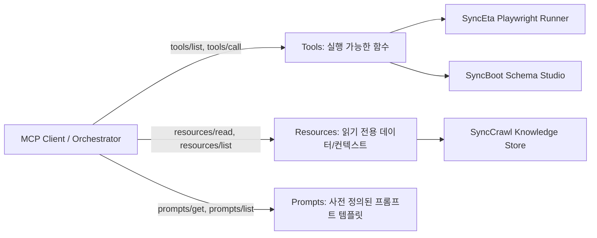

---
title: "Model Context Protocol(MCP) JSON-RPC 사양 분석과 도구 오케스트레이션"
description: "Anthropic에서 제안한 Model Context Protocol(MCP) 표준 규격을 분석하고, 엔터프라이즈 AI 에이전트 생태계에서 신뢰성 높은 도구 호출 및 분산 오케스트레이션을 구현하는 아키텍처 연구입니다."
head:
  - - meta
    - name: keywords
      content: Model Context Protocol, MCP, JSON-RPC 2.0, AI 에이전트 오케스트레이션, 도구 레지스트리, SyncVerse, SyncSeries
  - - meta
    - property: og:title
      content: "Model Context Protocol(MCP) JSON-RPC 사양 분석과 도구 오케스트레이션 | 엠파시(Empasy)"
sort: 30
---

# Model Context Protocol(MCP) JSON-RPC 사양 분석과 도구 오케스트레이션

## 1. 개요 및 연구 배경

대형 언어 모델(LLM)이 독자적인 애플리케이션에 갇히지 않고 실제 데이터베이스 조회, 파일 시스템 조작, 외부 API 호출, 브라우저 자동화 등 실제 비즈니스 작업을 수행하기 위해서는 **도구 호출(Tool Calling) 표준 인터페이스**가 필수적입니다.

기존의 독자적 Function Calling 방식은 각 LLM 제공자(OpenAI, Anthropic, Google)마다 스키마가 상이하여 벤더 종속성을 유발했습니다. **Model Context Protocol(MCP)**은 클라이언트와 도구 서버 간의 통신 규격을 **JSON-RPC 2.0** 기반으로 표준화하여, 에이전트가 단일한 방식으로 다양한 엔터프라이즈 리소스와 도구를 탐색하고 호출할 수 있도록 지원합니다.

---

## 2. MCP 아키텍처 및 3대 핵심 프리미티브

MCP 사양은 세 가지 주요 프리미티브를 정의합니다:



1. **Tools (실행 도구)**:
   - 클라이언트(에이전트)가 매개변수를 전달하여 부수 효과(Side-Effect)를 일으키는 호출 가능한 인터페이스입니다.
   - 예: `run_playwright_test`, `create_database_table`, `crawl_page`.
2. **Resources (리소스)**:
   - 파일, 데이터베이스 스키마, 로그 스트림 등 읽기 전용 컨텍스트 데이터를 제공합니다.
   - URI 스킴(`file://`, `postgres://`, `sync://`) 기반으로 접근합니다.
3. **Prompts (프롬프트 템플릿)**:
   - 사용자와 에이전트 간의 상호작용을 유도하는 재사용 가능한 워크플로우 템플릿입니다.

---

## 3. JSON-RPC 2.0 프로토콜 메시지 흐름

### 도구 목록 조회 (`tools/list`)

클라이언트가 서버가 지원하는 도구와 JSON Schema 매개변수 규격을 질의합니다.

```json
// Request
{
  "jsonrpc": "2.0",
  "id": 1,
  "method": "tools/list",
  "params": {}
}

// Response
{
  "jsonrpc": "2.0",
  "id": 1,
  "result": {
    "tools": [
      {
        "name": "run_regression_test",
        "description": "지정된 시나리오 ID에 대해 Playwright E2E 회귀 테스트를 실행합니다.",
        "inputSchema": {
          "type": "object",
          "properties": {
            "scenarioId": { "type": "string" },
            "headless": { "type": "boolean", "default": true }
          },
          "required": ["scenarioId"]
        }
      }
    ]
  }
}
```

### 도구 실행 요청 (`tools/call`)

```json
// Request
{
  "jsonrpc": "2.0",
  "id": 2,
  "method": "tools/call",
  "params": {
    "name": "run_regression_test",
    "arguments": {
      "scenarioId": "scn-checkout-flow",
      "headless": true
    }
  }
}

// Response
{
  "jsonrpc": "2.0",
  "id": 2,
  "result": {
    "content": [
      {
        "type": "text",
        "text": "테스트 통과: 12개 스텝 중 12개 성공 (0건 오류, 소요시간 2.4s)"
      }
    ],
    "isError": false
  }
}
```

---

## 4. 트랜스포트 레이어 비교: Stdio vs HTTP SSE

MCP는 두 가지 표준 트랜스포트를 규정하고 있습니다.

| 비교 항목 | Stdio (표준 입출력) | HTTP with SSE (Server-Sent Events) |
|:---|:---|:---|
| **동작 환경** | 단일 머신 로컬 프로세스 간 통신 | 분산 네트워크 및 컨테이너 환경 |
| **적용 사례** | SyncEta 데스크톱 내부 Playwright 프로세스 제어 | SyncVerse 중앙 관제탑과 원격 도메인 에이전트 연동 |
| **통신 프로토콜** | stdin/stdout 파이프 | HTTP POST (요청) + SSE (단방향 스트리밍) |
| **보안 및 인증** | OS 사용자 프로세스 권한 격리 | Bearer JWT, mTLS, IP 화이트리스트 |
| **확장성** | 로컬 머신 자원에 한정 | 로드밸런서 기반 수평적 스케일 아웃 가능 |

---

## 5. SyncSeries 멀티 에이전트 오케스트레이션 적용

SyncVerse 관제탑은 MCP를 통해 도메인 에이전트(SyncBoot, SyncCMS, SyncEta)를 오케스트레이션하며 다음과 같은 엔터프라이즈 패턴을 내재화했습니다:

1. **도구 레지스트리 동적 탐색**:
   각 도메인 에이전트 기동 시 SyncVerse 게이트웨이에 MCP 엔드포인트를 등록하고, 가용 도구를 동적으로 수집하여 LLM 시스템 프롬프트에 주입합니다.
2. **Human-in-the-Loop (HITL) 사전 승인 게이트**:
   데이터베이스 스키마 변경, 결제 데이터 수정, 프로덕션 배포 등 위험도가 높은 도구 호출의 경우 즉시 실행하지 않고 `status: WAITING_APPROVAL` 상태로 전환하여 관리자 승인을 대기합니다.
3. **Saga 보상 트랜잭션 연동**:
   다단계 워크플로우(예: API 스키마 생성 ➔ CMS 배포 ➔ E2E 테스트) 중 특정 단계 실패 시, 이전 단계의 보상 도구(`rollback_schema`, `unpublish_cms`)를 순서대로 역실행하여 데이터 정합성을 보장합니다.
