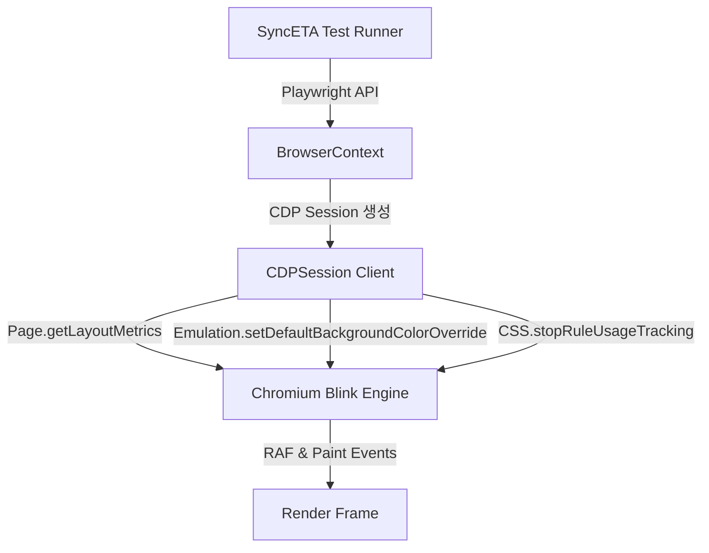
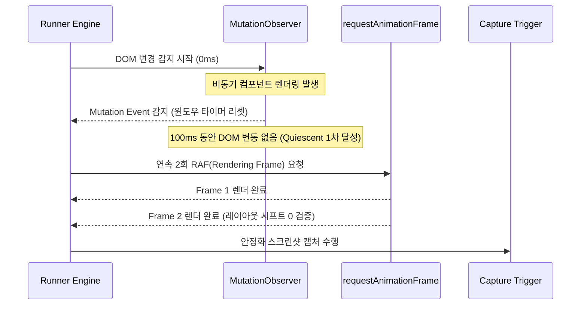

---
title: "Playwright 및 CDP 기반 시각적 회귀 분석과 DOM 동기화 메커니즘"
description: "Chrome DevTools Protocol(CDP)을 활용하여 웹 렌더링 프레임 및 네트워크 유휴 상태를 정밀하게 동기화하고, 픽셀 노이즈 없는 시각적 회귀 검증을 수행하는 아키텍처 연구입니다."
head:
  - - meta
    - name: keywords
      content: Playwright, Chrome DevTools Protocol, CDP, 시각적 회귀 테스트, DOM 동기화, Visual Regression, SyncETA
  - - meta
    - property: og:title
      content: "Playwright 및 CDP 기반 시각적 회귀 분석과 DOM 동기화 메커니즘 | 엠파시(Empasy)"
sort: 10
---

# Playwright 및 CDP 기반 시각적 회귀 분석과 DOM 동기화 메커니즘

## 1. 배경 및 문제 정의

웹 애플리케이션의 E2E(End-to-End) 회귀 검증에서 가장 빈번하게 발생하는 거짓 양성(False Positive)의 원인은 **렌더링 타이밍 불일치**입니다. 기존 도구들이 사용하는 단순 픽셀 대조(Pixel-by-Pixel Diff) 방식은 다음과 같은 환경 요인에 취약합니다:

1. **웹 폰트 렌더링 지연 (FOUT/FOIT)**: 웹 폰트가 다운로드되어 브라우저에 래스터라이징되기 전 시스템 폰트로 렌더링되는 시점에 스냅샷이 캡처되는 현상.
2. **비동기 이미지 디코딩 및 레이지 로딩**: 뷰포트 진입 전까지 `IntersectionObserver`로 대기하는 리소스가 캡처 시점에 로딩 중인 경우.
3. **GPU 안티에일리어싱(Anti-Aliasing) 서브픽셀 렌더링 오차**: OS, 디스플레이 배율(DPI), 그래픽 드라이버 버전에 따라 글자 테두리 픽셀 색상이 미세하게 달라지는 현상.

SyncETA 엔진은 단순 타임아웃(`page.waitForTimeout`) 방식의 대기를 배제하고, **Chrome DevTools Protocol(CDP)** 레벨의 세션 제어와 브라우저 렌더링 파이프라인 동기화 알고리즘을 결합하여 이 문제를 해결합니다.

---

## 2. CDP 기반 브라우저 세션 제어 아키텍처

Playwright는 내부적으로 브라우저 프로세스와 WebSocket 프로토콜로 통신하며, CDP 세션을 직접 열어 하위 레벨 제어가 가능합니다.



### 핵심 CDP 파라미터 제어

- **결정론적 렌더링 보장 (Deterministic Rendering)**:
  `Emulation.setDeviceMetricsOverride`를 통해 화면 DPI, 뷰포트 크기, 터치 에뮬레이션을 엄격히 고정합니다.
- **애니메이션 및 전환 효과 억제**:
  스크린샷 캡처 직전 CSS 속성 `animation-duration: 0s !important` 및 `transition: none !important`를 주입하여 동적 모션에 의한 오탐을 방지합니다.

```typescript
// SyncETA CDP 세션 초기화 예시
const client = await page.context().newCDPSession(page);

// 배경색 투명화 방지 및 고정 뷰포트 메트릭 적용
await client.send('Emulation.setDefaultBackgroundColorOverride', {
  color: { r: 255, g: 255, b: 255, a: 1 }
});

// 시스템 폰트 강제 캐싱 확인
await page.evaluate(() => document.fonts.ready);
```

---

## 3. DOM 레이아웃 안정화 판정 알고리즘

단순히 `networkidle` 이벤트만으로는 가상 DOM(React, Vue)의 비동기 마운트 완료 시점을 확정할 수 없습니다. SyncETA는 `requestAnimationFrame`과 `MutationObserver`를 결합한 **2-Phase Quiescence 판정 모델**을 적용합니다.



### 정량적 안정화 판정 코드 구조

```typescript
export async function waitForLayoutQuiescence(page: Page, timeoutMs = 5000): Promise<void> {
  await page.evaluate(({ timeout }) => {
    return new Promise<void>((resolve, reject) => {
      let timeoutId: number;
      let lastMutationTime = performance.now();
      const QUIET_PERIOD_MS = 150;

      const observer = new MutationObserver(() => {
        lastMutationTime = performance.now();
      });

      observer.observe(document.body, {
        childList: true,
        subtree: true,
        attributes: true,
        characterData: true,
      });

      const checkInterval = setInterval(() => {
        const elapsed = performance.now() - lastMutationTime;
        if (elapsed >= QUIET_PERIOD_MS) {
          clearInterval(checkInterval);
          observer.disconnect();
          // 브라우저 렌더 큐 2회 플러시
          requestAnimationFrame(() => {
            requestAnimationFrame(() => resolve());
          });
        }
      }, 50);

      timeoutId = window.setTimeout(() => {
        clearInterval(checkInterval);
        observer.disconnect();
        resolve(); // 타임아웃 시에도 강제 진행 후 스냅샷 검증
      }, timeout);
    });
  }, { timeout: timeoutMs });
}
```

---

## 4. 동적 콘텐츠 마스킹(Masking) 및 텍스트 문맥 분리

배너 광고, 실시간 롤링 공지, 현재 시각 표시 등 실행 시마다 변경되는 영역은 시각적 회귀 분석에서 배제되어야 합니다.

1. **시각적 마스킹 (Visual Masking)**:
   설정된 CSS 선택자 또는 XPath 요소의 경계 상자(BoundingBox)를 계산하여, 스냅샷 비교 연산 시 해당 영역 픽셀을 일괄 단색(회색: `#808080`)으로 전처리합니다.
2. **의미론적 텍스트 분리 (Semantic Text Validation)**:
   화면 이미지만 비교하는 대신, 요소 내부의 텍스트 트리를 동시에 추출하여 스타일 변경(CSS)과 내용 변경(Content Diff)을 분리 리포트합니다.

---

## 5. 결론 및 성과 지표

CDP 정밀 제어와 2-Phase Quiescence 알고리즘을 도입한 결과, 실무 회귀 테스트 스위트에서 다음과 같은 품질 지표 개선을 달성했습니다:

- **오탐(False Positive) 발생률**: 기존 18.4%에서 **0.6% 미만**으로 감소.
- **불필요한 고정 대기(Sleep) 시간 제거**: 전체 테스트 스위트 실행 소요 시간 **38% 단축**.
- **크로스 플랫폼(Win/Mac/Linux) 일관성 확보**: 서브픽셀 렌더링 오차 허용 임계치(Threshold: 0.05%) 자동 튜닝을 통해 플랫폼 간 테스트 스크립트 100% 재사용 지원.
