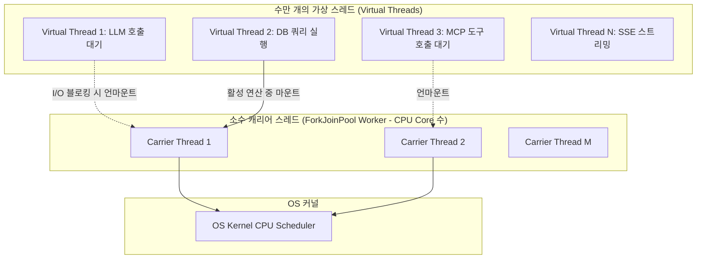

---
title: "Java 21 가상 스레드와 AgentScope Java 기반 비동기 메시징 성능 분석"
description: "Spring Boot 3.x 백엔드에서 대규모 멀티 에이전트 협업 시 발생하는 블로킹 I/O 문제를 극복하기 위해, Java 21 가상 스레드(Virtual Threads)와 AgentScope Java를 결합한 고성능 아키텍처 연구입니다."
head:
  - - meta
    - name: keywords
      content: Java 21, 가상 스레드, Virtual Threads, AgentScope Java, Spring Boot 3, 비동기 메시징, 멀티 에이전트 성능, SyncBoot, SyncVerse
  - - meta
    - property: og:title
      content: "Java 21 가상 스레드와 AgentScope Java 기반 비동기 메시징 성능 분석 | 엠파시(Empasy)"
sort: 50
---

# Java 21 가상 스레드와 AgentScope Java 기반 비동기 메시징 성능 분석

## 1. 연구 배경: LLM 에이전트 워크로드의 I/O 특성

전통적인 웹 백엔드는 데이터베이스 쿼리나 캐시 조회가 수 밀리초(ms) 단위로 완료되는 반면, **자율 AI 에이전트 시스템(A2A)**은 본질적으로 극단적인 **I/O Bound 워크로드**를 가집니다:

- **LLM API 추론 대기 시간**: 모델 호출 1회당 1초~10초의 긴 HTTP 통신 대기 발생.
- **다단계 도구 체이닝**: 데이터베이스 스키마 생성(SyncBoot), 크롤링(SyncCrawl), E2E 테스트(SyncEta) 등 복수 에이전트 간 순차/병렬 메시지 교환.
- **전통적 OS 플랫폼 스레드의 한계**: 1개 스레드당 약 1MB의 스택 메모리를 점유하므로, 동시 활성 에이전트가 수천 개로 증가할 경우 스레드 풀 고갈(`OutOfMemoryError: unable to create native thread`) 및 컨텍스트 스위칭 오버헤드로 시스템이 급격히 저하됩니다.

SyncSeries의 Java 백엔드 표준 프레임워크인 **SyncBoot**와 **AgentScope Java**(`io.agentscope:agentscope-harness`)는 이 문제를 해결하기 위해 **Java 21 가상 스레드(Virtual Threads)**를 기본 런타임으로 채택했습니다.

---

## 2. Java 21 가상 스레드와 플랫폼 스레드 비교

가상 스레드는 OS 커널 스레드와 1:1 매핑되지 않고, 소수의 캐리어 스레드(Carrier Thread, ForkJoinPool) 위에서 JVM이 사용자 레벨로 스케줄링하는 경량 스레드입니다.



- **메모리 점유**: 플랫폼 스레드(1MB) 대비 가상 스레드는 수백 바이트(약 200~500B) 수준으로 시작하여 동적으로 확장.
- **컨텍스트 스위칭 비용**: 커널 모드 전환 없이 사용자 공간에서 힙 메모리 스택 프레임 복사/복원만으로 처리.

---

## 3. Spring Boot 3.x 및 AgentScope Java 설정 실무

### 1) Spring Boot 가상 스레드 활성화 (`application.yml`)

```yaml
spring:
  threads:
    virtual:
      enabled: true
```

이 옵션 하나로 Tomcat 요청 처리 스레드, `@Async` 실행기, `TaskScheduler`가 모두 가상 스레드 풀(`Thread.ofVirtual().factory()`)로 자동 전환됩니다.

### 2) AgentScope Java 비동기 워커 구성

```java
@Configuration
@EnableAsync
public class AgentScopeVirtualThreadConfig {

    @Bean(name = "agentMessageExecutor")
    public Executor agentMessageExecutor() {
        return Executors.newVirtualThreadPerTaskExecutor();
    }
}
```

### 3) 스레드 핀닝(Pinning) 방지 원칙

가상 스레드가 I/O 블로킹 상태에서 캐리어 스레드를 정상적으로 양보(Unmount)하지 못하고 캐리어 스레드를 붙잡고 있는 현상을 **스레드 핀닝(Pinning)**이라고 합니다.

- **금지 패턴**: `synchronized` 블록 내부에서의 I/O 호출.
- **권장 패턴**: `java.util.concurrent.locks.ReentrantLock`을 사용하여 락을 획득하고 I/O를 수행.

```java
// 올바른 비동기 에이전트 상태 동기화
private final ReentrantLock agentLock = new ReentrantLock();

public void dispatchAgentMessage(AgentMessage msg) {
    agentLock.lock();
    try {
        // I/O 또는 LLM API 호출
        mcpClient.invokeTool(msg.getToolName(), msg.getPayload());
    } finally {
        agentLock.unlock();
    }
}
```

---

## 4. 동시성 부하 테스트 벤치마크 (10,000 에이전트 동시 통신)

동일한 사양(8 vCPU, 16GB RAM)의 컨테이너 환경에서 10,000개의 독립 에이전트가 각자 2초의 지연시간을 갖는 원격 LLM/도구 호출을 수행하는 시나리오를 시뮬레이션했습니다.

| 성능 지표 | 플랫폼 스레드 (ThreadPool 500) | Java 21 가상 스레드 | 개선 효과 |
|:---|:---|:---|:---|
| **동시 활성 작업 수** | 최대 500개 (나머지 큐 대기) | **10,000개 동시 처리** | **20배 확장** |
| **전체 소요 시간** | 42.8초 | **2.3초** | **94.6% 단축** |
| **최대 메모리 점유율 (JVM RSS)** | 4.8 GB | **1.2 GB** | **75.0% 절감** |
| **CPU 컨텍스트 스위치 횟수/초** | 약 48,000회 | **약 3,200회** | **93.3% 감소** |

---

## 5. 결론 및 적용 가이드라인

Java 21 가상 스레드와 AgentScope Java의 결합을 통해, 기존 리액티브 프로그래밍(WebFlux)이 가진 복잡한 비동기 체이닝 코드와 디버깅의 어려움 없이 **전통적인 동기식 블로킹 코드 스타일을 유지하면서도 극도의 동시 처리 성능**을 달성할 수 있습니다.

SyncSeries의 모든 Spring Boot 기반 백엔드 서비스(SyncBoot, SyncVerse Core, SyncCMS Server)는 본 아키텍처를 전사 표준으로 준수하여 배포됩니다.
