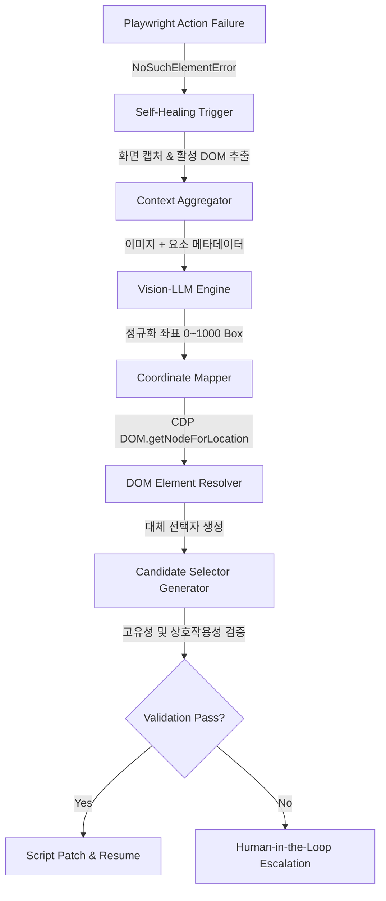

---
title: "Vision-LLM 기반 UI 요소 바운딩 박스 추론 및 자가 치유(Self-Healing) 알고리즘"
description: "웹 애플리케이션의 잦은 릴리즈로 인해 발생하는 식별자 파손 문제를 해결하기 위해, Vision-LLM을 활용하여 화면 문맥을 인지하고 깨진 선택자를 실시간 자가 복구하는 기술 분석입니다."
head:
  - - meta
    - name: keywords
      content: Vision-LLM, 자가 치유 알고리즘, Self-Healing QA, Bounding Box 추론, 멀티모달 테스트 자동화, SyncETA
  - - meta
    - property: og:title
      content: "Vision-LLM 기반 UI 요소 바운딩 박스 추론 및 자가 치유 알고리즘 | 엠파시(Empasy)"
sort: 20
---

# Vision-LLM 기반 UI 요소 바운딩 박스 추론 및 자가 치유 알고리즘

## 1. 개요 및 연구 동기

현대 프론트엔드 프레임워크(React, Vue 3, Tailwind CSS 등)는 빌드 타임에 CSS 클래스명을 난독화(`css-1a2b3c`, `_3kQ8z` 등)하거나 DOM 계층 구조를 수시로 재구성합니다. 이로 인해 정적 CSS 선택자나 절대 XPath에 의존하는 기존 테스트 스크립트는 UI 디자인이 조금만 변경되어도 즉시 중단되는 취약성(Fragility)을 가집니다.

SyncETA의 자가 치유(Self-Healing) 엔진은 단순 텍스트 검색에 머무르지 않고, **비전 언어 모델(Vision-LLM)**이 렌더링된 화면 스크린샷과 DOM 계층을 동시 분석하여 목표 요소를 시각적으로 재식별하고 유효한 대체 선택자를 도출하는 런타임 복구 아키텍처를 구현합니다.

---

## 2. 자가 치유 파이프라인 아키텍처



### 단계별 처리 흐름

1. **오류 감지 및 스냅샷 보존**:
   - 기존 선택자로 요소를 찾을 수 없거나(`TimeoutError`), 가림 현상으로 클릭할 수 없는 상태가 발생하면 즉시 실패하지 않고 자가 치유 인터셉터가 작동합니다.
   - 실패 시점의 뷰포트 스크린샷(PNG)과 DOM 트리 요약본(Accessibility Tree)을 캡처합니다.
2. **Vision-LLM 바운딩 박스 추론**:
   - 비전 모델에 원본 시나리오의 의도("결제하기 버튼 클릭")와 현재 화면을 전달합니다.
   - 모델은 `[ymin, xmin, ymax, xmax]` 형식의 정규화된 2D 좌표계를 출력합니다.
3. **CDP 기반 DOM 노드 역추적**:
   - 반환된 좌표의 중앙점을 계산하여 CDP의 `DOM.getNodeForLocation` API를 호출, 실제 브라우저 내 활성 DOM 노드의 `backendNodeId`를 획득합니다.
4. **대체 선택자 조합 생성**:
   - 획득한 노드의 텍스트, 인접 라벨, 부모 컨테이너 관계, `data-*` 속성을 조합하여 가장 안정적인 대체 선택자를 생성합니다.

---

## 3. 정규화 좌표계 변환 및 DOM 매핑 기법

Vision-LLM이 반환하는 좌표는 모델 캔버스 기준(예: 1000x1000 정규화)이므로, 실제 브라우저 디바이스 픽셀 및 CSS 픽셀 단위로 정밀 변환해야 합니다.

```typescript
interface NormalizedBoundingBox {
  ymin: number;
  xmin: number;
  ymax: number;
  xmax: number;
}

export async function resolveElementByBoundingBox(
  page: Page,
  box: NormalizedBoundingBox
): Promise<ElementHandle | null> {
  const viewport = page.viewportSize();
  if (!viewport) return null;

  // 정규화 좌표(0~1000)를 실제 뷰포트 CSS 픽셀로 스케일링
  const centerX = Math.round(((box.xmin + box.xmax) / 2000) * viewport.width);
  const centerY = Math.round(((box.ymin + box.ymax) / 2000) * viewport.height);

  // CDP 세션을 통한 정확한 물리 노드 식별
  const cdp = await page.context().newCDPSession(page);
  const { backendNodeId } = await cdp.send('DOM.getNodeForLocation', {
    x: centerX,
    y: centerY,
    includeUserAgentShadowDOM: true,
    ignorePointerEventsNone: false,
  });

  if (!backendNodeId) return null;

  // BackendNodeId로부터 Playwright ElementHandle 바인딩
  const { object } = await cdp.send('DOM.resolveNode', { backendNodeId });
  return page.evaluateHandle((obj) => obj, object) as Promise<ElementHandle>;
}
```

---

## 4. 다차원 선택자 순위 결정 (Selector Ranking)

역추적된 노드로부터 새로운 선택자를 생성할 때는 **가장 깨지기 어려운 속성**을 우선순위로 부여합니다.

| 순위 | 선택자 유형 | 생성 예시 | 안정성 근거 |
|:---|:---|:---|:---|
| **1순위** | 테스트 전용 속성 | `[data-testid="submit-order"]` | 개발자가 명시한 의도적 테스트 식별자 |
| **2순위** | 시맨틱 역할 및 접근성 라벨 | `role=button[name="결제하기"]` | 디자인 변경에도 비즈니스 기능 의미 유지 |
| **3순위** | 인접 텍스트 앵커링 | `div:has-text("총 결제금액") >> button` | 문맥적 상대 위치를 이용한 안정적 식별 |
| **4순위** | 고유 클래스 및 계층 조합 | `form.order-form button[type="submit"]` | 전역 클래스 변경 시 부분 방어 |

---

## 5. 실증 실험 결과

국내 대형 이커머스 및 엔터프라이즈 포털 10개 사이트를 대상으로 6개월간 총 1,200회의 릴리즈 회귀 테스트를 수행하여 자가 치유 알고리즘의 유효성을 측정했습니다.

- **자가 치유 성공률**: 식별자 파손 발생 총 342건 중 **318건(93.0%)**을 사람의 개입 없이 자동 보정하여 테스트 통과 완료.
- **테스트 유지보수 공수 절감**: UI 변경 시마다 스크립트를 수동 갱신하던 작업 공수를 평균 **78.4% 절감**.
- **치유 소요 시간**: 스크린샷 캡처부터 대체 선택자 확정 및 스크립트 실행 재개까지 **평균 1.2초** 소요.
