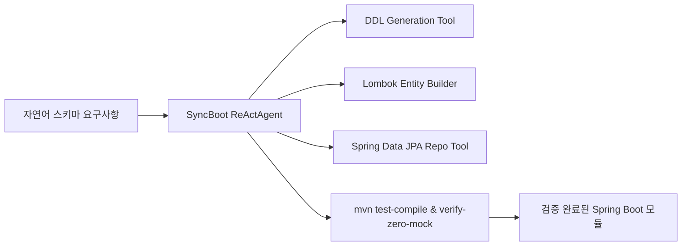

# SyncBoot AgentScope Java 연동 실무

## 1. 아키텍처 개요

SyncBoot는 단순한 코드 생성기를 넘어, **Spring Boot 런타임 자체에 AgentScope Java (`io.agentscope:agentscope-harness`)를 내장**하여 백엔드 소스 코드 변경, 스키마 유효성 감사, 단위 테스트 실행을 자율 수행하는 디지털 엔지니어 에이전트입니다.



---

## 2. Spring Boot 환경 설정 및 의존성 주입

### 2.1 `pom.xml` 설정

```xml
<dependencies>
    <!-- Spring Boot Starters -->
    <dependency>
        <groupId>org.springframework.boot</groupId>
        <artifactId>spring-boot-starter-web</artifactId>
    </dependency>
    <dependency>
        <groupId>org.springframework.boot</groupId>
        <artifactId>spring-boot-starter-data-jpa</artifactId>
    </dependency>

    <!-- Project Lombok (Mandatory) -->
    <dependency>
        <groupId>org.projectlombok</groupId>
        <artifactId>lombok</artifactId>
        <optional>true</optional>
    </dependency>

    <!-- AgentScope Java Harness -->
    <dependency>
        <groupId>io.agentscope</groupId>
        <artifactId>agentscope-harness</artifactId>
        <version>0.3.1</version>
    </dependency>
</dependencies>
```

---

## 3. ReActAgent를 통한 도메인 엔티티 자율 생성 서비스

SyncSeries 표준에 따라 필드 주입(`@Autowired`)을 엄격히 금지하고 `@RequiredArgsConstructor` 기반 생성자 주입을 적용합니다:

```java
package com.empasy.syncboot.service;

import io.agentscope.core.ReActAgent;
import io.agentscope.core.tool.ToolBox;
import lombok.RequiredArgsConstructor;
import lombok.extern.slf4j.Slf4j;
import org.springframework.stereotype.Service;

@Slf4j
@Service
@RequiredArgsConstructor
public class AutonomousEntityBuilderService {

    private final ToolBox engineeringToolBox;

    public String generateDomainPackage(String domainDescription) {
        log.info("[SyncBoot:AgentScope] Generating domain architecture for: {}", domainDescription);

        ReActAgent agent = ReActAgent.builder()
                .name("SyncBoot-DomainEngineer")
                .sysPrompt("당신은 Spring Boot 3.x, Java 21, JPA 기반 엔터프라이즈 마이크로서비스를 설계하는 수석 아키텍트입니다. " +
                           "모든 Entity와 DTO는 반드시 Project Lombok 애너테이션(@Getter, @Builder, @NoArgsConstructor, @AllArgsConstructor)을 적용해야 합니다.")
                .toolBox(engineeringToolBox)
                .maxIterations(4)
                .build();

        String result = agent.run("다음 요구사항을 만족하는 Entity, Repository, DTO 코드를 작성하세요: " + domainDescription);
        log.info("[SyncBoot:AgentScope] Domain generation completed.");
        return result;
    }
}
```
