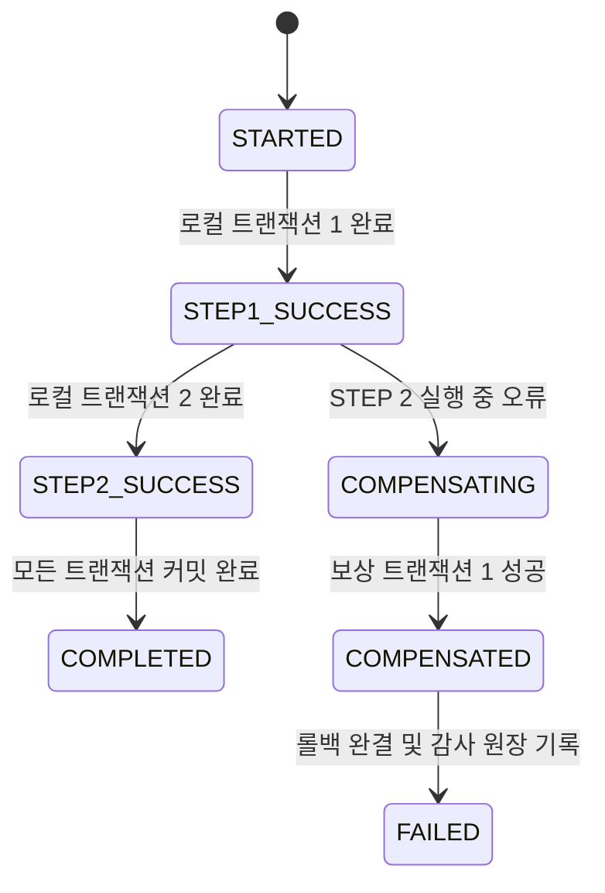

# SyncBoot Saga 분산 트랜잭션 구현

## 1. MSA 분산 트랜잭션의 도전 과제

마이크로서비스 아키텍처(MSA)에서는 각 서비스가 독립된 데이터베이스를 소유하므로, 전통적인 단일 DB 2PC(Two-Phase Commit) 분산 락은 시스템 가용성을 심각하게 저해합니다.  
SyncBoot는 **Saga 패턴(Orchestrated Saga)**을 표준으로 채택하여 비동기 메시지 또는 REST 이벤트를 통해 로컬 트랜잭션을 연속 실행하고, 중간 실패 시 사전에 정의된 **보상 트랜잭션(Compensating Transaction)**을 역순으로 자율 실행합니다.

---

## 2. 분산 트랜잭션 상태 머신 (State Machine)



---

## 3. 보상 트랜잭션 실행 인터페이스 구현

모든 분산 액션은 `SagaStep` 인터페이스를 상속받아 정방향 실행(`execute`)과 역방향 롤백(`compensate`)을 1:1로 구현해야 합니다:

```java
package com.empasy.syncboot.saga;

public interface SagaStep<T, R> {
    String getStepName();
    R execute(T context);
    void compensate(T context);
}
```

### 3.1 주문-재고 연동 Saga Step 예제

```java
package com.empasy.syncboot.saga.steps;

import com.empasy.syncboot.saga.SagaStep;
import lombok.*;
import lombok.extern.slf4j.Slf4j;
import org.springframework.stereotype.Component;

@Slf4j
@Component
public class InventoryDeductionStep implements SagaStep<OrderContext, Boolean> {

    @Override
    public String getStepName() {
        return "INVENTORY_DEDUCTION";
    }

    @Override
    public Boolean execute(OrderContext context) {
        log.info("[Saga:Tx] Deducting stock for item: {}, qty: {}", context.getProductId(), context.getQuantity());
        // 실제 재고 감액 비즈니스 로직 수행
        return true;
    }

    @Override
    public void compensate(OrderContext context) {
        log.warn("[Saga:Compensate] Rolling back inventory for item: {}, restoring qty: {}", 
                context.getProductId(), context.getQuantity());
        // 결제 실패 등에 따른 재고 복원 보상 쿼리 실행
    }
}
```
