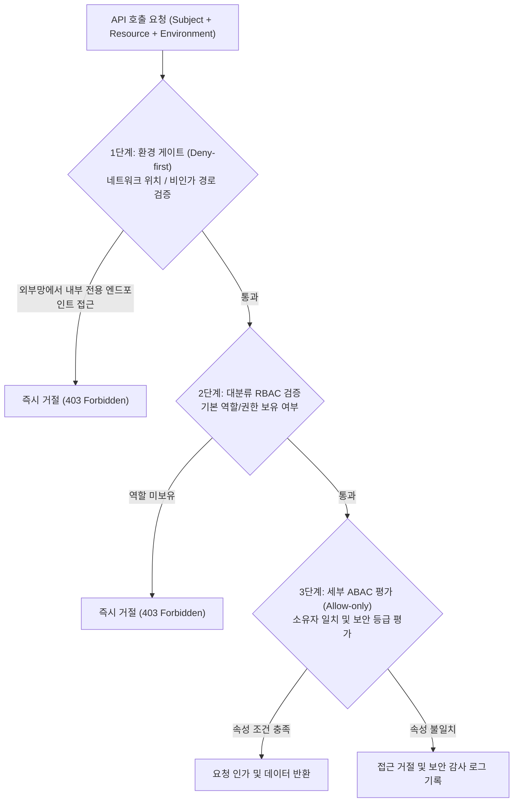

# 속성 기반 접근 제어(ABAC) 및 크롤링 데이터 보안 체계

## 1. 도입 배경 및 RBAC의 한계

전통적인 역할 기반 접근 제어(RBAC)는 사용자의 역할(`ROLE_USER`, `ROLE_ADMIN` 등)을 기준으로 API 엔드포인트의 접근 여부를 판별합니다. 그러나 수집 데이터 및 다중 에이전트가 협업하는 환경에서는 다음과 같은 복합 권한 검증에 한계가 드러납니다:

1. **테넌트 및 부서별 데이터 격리 부재**: 동일한 수집 담당자 역할이라도 A 사업부에서 수집한 경쟁사 분석 데이터에 B 사업부 담당자가 접근해서는 안 되는 세분화된 소유권(Data Ownership) 통제 필요.
2. **에이전트 간 통신 신뢰 체계**: 백엔드 내부 워커 에이전트 간의 통신(Pod-to-Pod)이 일반 사용자 세션을 완전히 우회(Implicit Bypass)하지 않도록 명시적 토큰과 속성을 검증해야 함.
3. **네트워크 환경에 따른 동적 차단**: 동일한 관리자 계정이라 할지라도 사내 내부망(VNet)이 아닌 외부 공용망에서 유입되는 특정 관리 도구 호출은 차단되어야 함.

`SyncCrawl`은 이를 해결하기 위해 주체, 자원, 환경의 다차원 속성을 결합 평가하는 **속성 기반 접근 제어(ABAC: Attribute-Based Access Control)** 아키텍처를 적용하였습니다.

---

## 2. ABAC 속성 인벤토리 (Attribute Inventory)

권한 평가는 정규화된 3가지 범주의 속성을 조합하여 수행됩니다.

### 1) 주체 속성 (Subject Attributes)
- `userId / username`: 요청자 고유 식별자
- `tenantId / orgId`: 다중 테넌트 및 소속 부서 식별자
- `roles / permissions`: 기존 RBAC 체계에서 부여된 권한 집합
- `agentToken`: 내부 시스템 에이전트 통신용 서명 및 인증 토큰 (`Signed Header`)

### 2) 자원 속성 (Resource Attributes)
- `resourceId / ownerId`: 수집 데이터의 고유 키 및 소유자 식별자
- `resourceType`: 접근 대상 객체 유형 (예: `CrawledDataset`, `Scenario`, `Credential`)
- `sensitivityClassification`: 데이터의 보안 등급 (`PUBLIC`, `INTERNAL`, `RESTRICTED`)

### 3) 환경 속성 (Environment Attributes)
- `networkLocation`: 내부 VPC/AKS 클러스터 내부 통신인지, 공용 인터넷 게이트웨이 유입인지 여부
- `endpointType`: 호출된 URI의 용도 (`INTERNAL_SYSTEM_API` vs `EXTERNAL_CLIENT_API`)

---

## 3. 정책 평가 3단계 우선순위 (Policy Precedence)

권한 검사는 단일화된 `AuthorizationContext` 내에서 사전에 정의된 엄격한 순서(Precedence)에 따라 순차 평가됩니다.

1. **1단계: 환경 게이트 (Deny-first)**:
   - 내부 에이전트 전용 엔드포인트(예: `/api/internal/worker/*`)에 퍼블릭 인그레스를 통한 외부 접근이 감지되면 즉시 차단합니다.
2. **2단계: 대분류 RBAC 검사**:
   - 요청 주체가 해당 도메인의 기본 권한(예: `@PreAuthorize("hasPermission('crawling:read')")`)을 보유하고 있는지 검증합니다.
3. **3단계: 세부 ABAC 및 데이터 권한 검사 (Allow-only)**:
   - 요청 주체의 `tenantId`와 자원의 테넌트 소속이 일치하는지 확인합니다.
   - 자원의 보안 등급이 `RESTRICTED`인 경우 주체의 인가 등급과 자원 소유자(`ownerId`) 일치 여부를 최종 대조하여 단일 조건이라도 위배되면 접근을 거부합니다.

---

## 4. 내부 에이전트 토큰 인증 및 감사 추적

- **Signed Header 검증**:
  - 분산 워커 에이전트(`smart-crawling-agent`)가 중앙 서버로 수집 데이터를 전송할 때, 타임스탬프와 비밀 키로 서명된 `X-Sync-Agent-Token` 헤더를 첨부합니다.
- **재전송 공격 방지**:
  - 서명된 토큰의 유효 시간은 60초로 제한되며, 동일한 서명 토큰의 재사용 시도는 서버 메모리 윈도우에서 즉각 차단됩니다.
- **보안 감사 리포트 연계**:
  - 모든 권한 평가 성공 및 실패 내역은 비인가 접근 시도 IP와 주체 식별자를 포함하여 WORM 감사 로그에 기록되어 보안 컴플라이언스 증적으로 활용됩니다.
