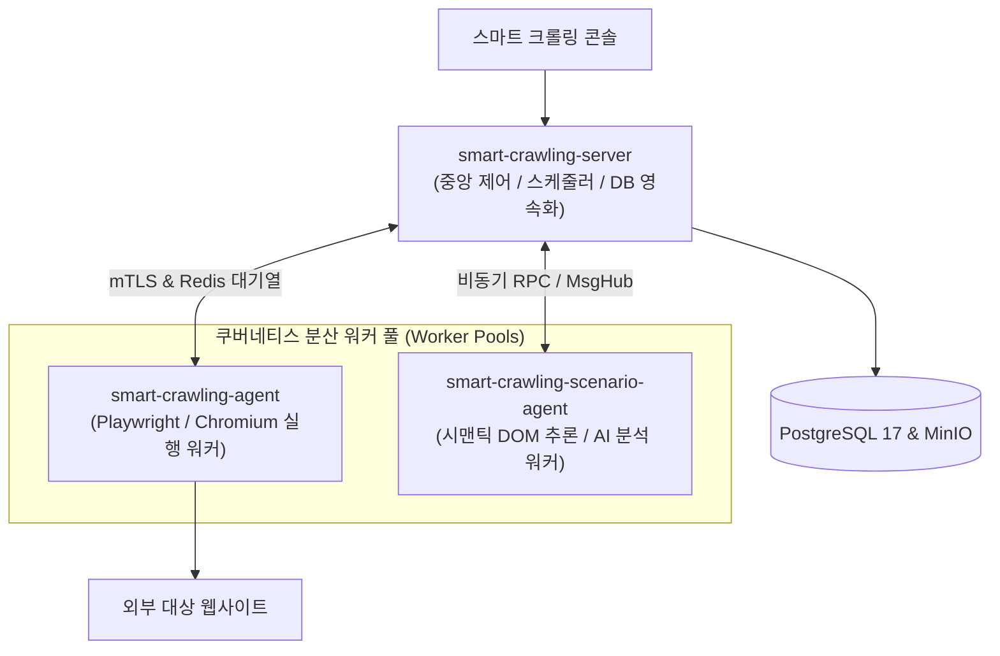

# 3계층 분산 에이전트 토폴로지 및 배포 인프라

## 1. 개요 및 계층 분리 목적

단일 모놀리스 서버에서 브라우저 자동화와 대규모 LLM 추론을 동시에 수행할 경우, Chromium 브라우저 프로세스가 메모리를 대량 점유하여 중앙 API 서버가 다운되거나 응답 지연이 발생하는 위험이 있습니다.

`SyncCrawl`은 부하 격리와 무중단 확장을 위해 시스템을 **중앙 오케스트레이션 서버**, **브라우저 실행 워커 에이전트**, **AI 시나리오 추론 워커 에이전트**의 3계층으로 물리적 분리하여 운영합니다.



---

## 2. 3계층 서비스 역할 및 책임 (R&R)

### 1) smart-crawling-server (중앙 오케스트레이션 서버)
- **책임**:
  - 수집 작업 정의 및 Cron 스케줄링 관리.
  - Redis 메시지 큐를 통한 워커 에이전트로의 작업 분배 및 동시성 제어.
  - 수집 완료된 원시 데이터의 RDB 저장, 인덱싱 및 RESTful API 제공.
- **리소스 특성**: CPU 및 메모리 사용량이 예측 가능하며 안정적인 장기 실행(Long-running) 서비스.

### 2) smart-crawling-agent (브라우저 수집 워커)
- **책임**:
  - Playwright 기반의 Chromium 브라우저 인스턴스를 기동하여 웹페이지 접속, 세션 유지 및 데이터 추출 수행.
  - 봇 탐지 회귀 방지를 위한 브라우저 지문(Fingerprint) 정규화 적용.
- **리소스 특성**: 일시적으로 높은 CPU 및 메모리 버스트가 발생하므로, KEDA 기반으로 큐 적재량에 따라 2대에서 20대까지 동적으로 오토스케일링.

### 3) smart-crawling-scenario-agent (AI 시나리오 추론 워커)
- **책임**:
  - 대상 웹페이지의 시맨틱 DOM 트리 분석, 비전 스크린샷 융합 추론 및 신규 셀렉터 자가치유 합성.
  - LLM 게이트웨이(`SyncLLM`)와 통신하여 비정형 데이터 추출 규칙을 생성.
- **리소스 특성**: 네트워크 I/O 및 대규모 JSON 파싱에 최적화된 독립 Pod로 배포.

---

## 3. 쿠버네티스(AKS) 배포 및 보안 시크릿 주입

워커 에이전트가 대상 웹사이트의 인증 자격증명(ID/Password)이나 데이터베이스 접속 정보를 평문 환경변수로 보유하지 않도록, **Azure KeyVault CSI Driver** 및 **Kubernetes Secrets**를 연계합니다.

```yaml
apiVersion: apps/v1
kind: Deployment
metadata:
  name: smart-crawling-agent
  namespace: sync-crawl
spec:
  replicas: 3
  template:
    spec:
      containers:
      - name: crawling-worker
        image: harbor.empasy.internal/syncseries/smart-crawling-agent:2026.10
        resources:
          limits:
            cpu: "4"
            memory: 8Gi
          requests:
            cpu: "1"
            memory: 2Gi
        volumeMounts:
        - name: secrets-store-inline
          mountPath: "/mnt/secrets-store"
          readOnly: true
      volumes:
      - name: secrets-store-inline
        csi:
          driver: secrets-store.csi.k8s.io
          readOnly: true
          volumeAttributes:
            secretProviderClass: "sync-crawl-keyvault"
```

---

## 4. 장애 격리 및 안전 통신 규격

- **Pod-to-Pod mTLS 통신**:
  - 클러스터 내부에서 서버와 워커 간에 전달되는 모든 크롤링 제어 패킷은 Istio 서비스 메시의 상호 TLS(mTLS)를 통해 암호화됩니다.
- **워커 크래시 격리 (Process Sandboxing)**:
  - 악의적인 웹페이지 스크립트로 인해 특정 브라우저 프로세스가 메모리 누수로 크래시되더라도, 해당 워커 Pod 내의 단일 프로세스만 종료되고 중앙 서버나 타 워커의 작업에는 일체 영향을 미치지 않습니다.
  - 실패한 작업은 백엔드 대기열에서 감지되어 다른 정상 워커로 안전하게 재할당됩니다.
