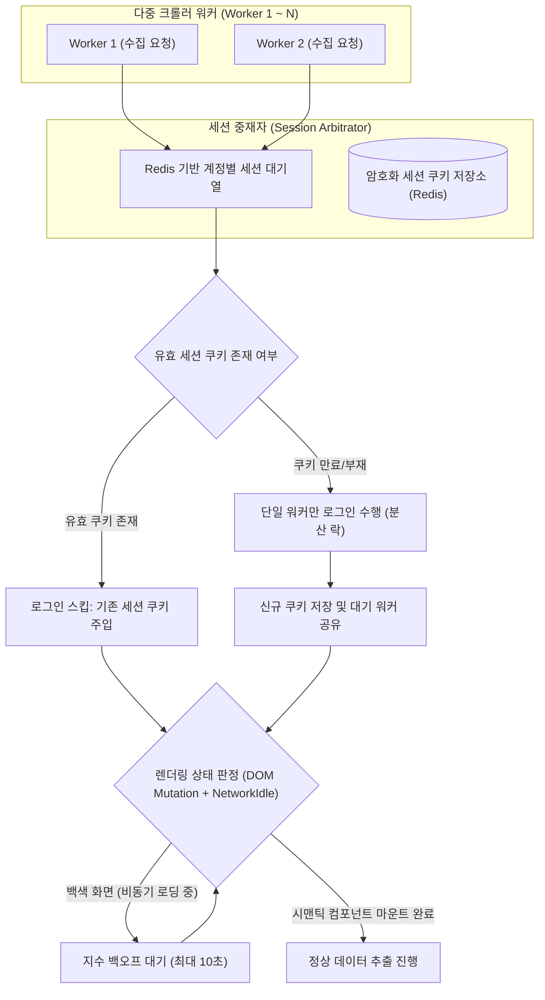

# 동시 세션 중재 및 백색 화면 오탐 방지 가이드

## 1. 개요 및 런타임 장애 요인

웹 자동화 크롤러가 실제 기업 운영 환경에서 직면하는 대표적인 실패 사례는 대상 사이트의 **동시 다중 로그인 차단 정책**과 **SPA(Single Page Application) 비동기 렌더링 지연**에서 비롯됩니다:

1. **동시 로그인 세션 킥(Session Kick)**:
   - 복수의 수집 워커가 동일한 서비스 계정으로 동시에 로그인을 시도할 경우, 기존 세션이 강제 종료되거나 계정이 비정상 접근으로 임시 잠금(Lockout)되는 사고.
2. **백색 화면(White-Screen) 오탐**:
   - React나 Vue 기반 SPA 사이트에서 자바스크립트 청크 다운로드나 API 응답 지연으로 화면이 일시적으로 하얗게 비어 있는 상태를 크롤러가 '페이지 로딩 실패'로 오인하여 불필요한 재시도를 반복하는 현상.

`SyncCrawl`은 **중앙 세션 중재 큐**와 **DOM 변이 감지 기반 렌더링 판정 엔진**을 통해 이러한 런타임 예외를 안정화하였습니다.

---

## 2. 동시 다중 로그인 세션 중재 (Session Arbitration)

동일 타깃 사이트에 대해 여러 크롤러 워커가 동시에 작업을 수행할 때, 로그인을 매번 중복 수행하지 않도록 중앙 중재 메커니즘을 적용합니다.

### 1) 세션 쿠키 저장소 및 재사용
- 크롤러 워커는 로그인 절차를 진행하기 전, Redis 세션 저장소에서 해당 계정의 유효한 세션 쿠키(Cookie & LocalStorage)가 존재하는지 먼저 확인합니다.
- 유효한 세션이 존재하면 브라우저 컨텍스트에 쿠키를 즉시 주입하여 로그인 페이지를 거치지 않고 타깃 페이지로 직행합니다.

### 2) 원자적 단일 로그인 (Single-Flight Login)
- 세션이 만료되어 재인증이 필요한 경우, `account:lock:{siteId}:{username}` 분산 락을 획득한 단 1개의 워커만 로그인 폼을 입력하고 인증을 수행합니다.
- 나머지 대기 중인 워커들은 세션 큐에서 대기하다가, 최초 워커가 인증을 완료하고 저장소에 신규 쿠키를 갱신하면 해당 쿠키를 전달받아 동시에 작업을 재개합니다.
- 이를 통해 대상 사이트에 동시 중복 로그인이 발생하는 것을 방지하고 계정 보호 정책에 저촉되지 않도록 통제합니다.

---

## 3. 백색 화면(White-Screen) 오탐 방지 알고리즘

단순히 `networkidle` 또는 `DOMContentLoaded` 이벤트에만 의존할 경우, 네트워크 통신은 끝났으나 클라이언트 측 가상 DOM 렌더링이 완료되지 않아 빈 흰색 화면을 캡처하는 오류가 발생합니다.

`SyncCrawl`은 3가지 복합 지표를 결합하여 화면 준비 상태를 판정합니다:

1. **DOM Mutation Observer 결합**:
   - `document.body` 하위 노드의 변경 이벤트(자식 노드 추가, 텍스트 변경)가 500ms 동안 추가로 발생하지 않는 정체(Quiescence) 상태를 확인합니다.
2. **텍스트 밀도 및 가시적 노드 평가**:
   - 렌더링된 화면 내에서 실제 사용자에게 가시적인 텍스트 노드의 문자 수(Character Count)와 블록 태그(`
`, `
`, `<tr>` 등)의 총량이 최소 임계치(예: 텍스트 50자 이상)를 충족하는지 검사합니다.
3. **로딩 스피너 소멸 감지**:
   - 공통 로딩 인디케이터 클래스(예: `.spinner`, `.loading`, `[role="progressbar"]`)가 DOM에서 완전히 사라졌는지 확인한 후 추출 로직으로 이행합니다.

---

## 4. 임시 파일 다운로드 격리 및 자동 정리

- 대용량 첨부파일이나 PDF 공시 문서를 수집하는 과정에서 다운로드가 미완료된 채 크롤러가 종료될 경우, 디스크 용량 누수나 파일 파손이 초래될 수 있습니다.
- 워커 프로세스별로 UUID 기반의 임시 디렉터리(`/tmp/crawl_session_{uuid}`)를 생성하여 다운로드를 격리 수행하며, 다운로드 완료 후 SHA-256 해시 검증을 통과한 파일만 영구 오브젝트 스토리지(MinIO)로 이관하고 임시 디렉터리는 즉각 삭제(`clean-up`)합니다.
