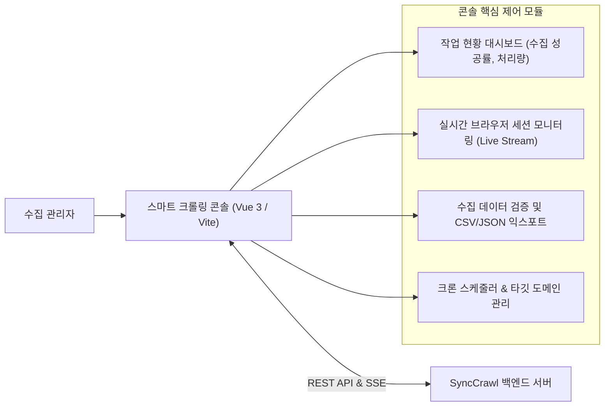

# 스마트 크롤링 콘솔 아키텍처 및 실시간 관제 가이드

## 1. 개요 및 콘솔 설계 목적

대규모 웹 데이터 수집 환경에서는 수많은 크롤러 에이전트가 비동기적으로 실행되므로, 전체 작업 상태를 한눈에 파악하고 이상 징후를 실시간으로 통제할 수 있는 통합 운영 도구가 필수적입니다.

`SyncCrawl`의 **스마트 크롤링 콘솔(Smart Crawling Console)**은 Vue 3, Vite, TypeScript 기반으로 경량화된 단일 페이지 애플리케이션(SPA)으로 구축되어 있으며, 관리자가 수집 대상 도메인 관리부터 실시간 브라우저 실행 화면 관측, 수집 데이터 무결성 검증까지 원스톱으로 제어할 수 있는 환경을 제공합니다.

---

## 2. 콘솔 핵심 기능 구성

### 1) 실시간 수집 세션 관제 (Live Session Monitoring)
- 현재 동작 중인 워커 에이전트의 브라우저 인스턴스별 탐색 단계(페이지 접속, 로그인, 데이터 추출, 렌더링 대기)를 Server-Sent Events(SSE) 스트림으로 수신합니다.
- 특정 에이전트가 CAPTCHA(문자 인증)나 봇 차단 화면에 직면한 경우, 관리자 화면에 즉각 경고 배지가 점등되며 필요한 경우 관리자가 원격 세션에 개입(HITL)할 수 있는 인터페이스를 제공합니다.

### 2) 수집 템플릿 및 셀렉터 디버거 (Selector Studio)
- 시맨틱 DOM 기반으로 자동 합성된 추출 셀렉터(XPath / CSS 정규식 앵커)를 실시간 웹페이지 DOM 구조 상에서 시각적으로 하이라이트하여 검증할 수 있습니다.
- 대상 웹사이트의 마크업이 변경되었을 때, AI가 제안한 신규 셀렉터의 매칭 결과(추출된 텍스트, 속성값)를 사전 비교 검증한 후 템플릿 DB에 반영할 수 있습니다.

### 3) 수집 데이터 정합성 검증 그리드
- 수집된 원시 데이터(Raw HTML)와 정제된 구조화 데이터(JSON)를 나란히 대조할 수 있는 분할 뷰(Split View)를 제공합니다.
- 필수 필드(예: 상품 가격, 공시 번호, 발행 일자)의 누락 여부를 정적 유효성 검사 규칙(Schema Validation)으로 실시간 평가하여 불완전한 레코드를 사전에 격리합니다.

---

## 3. 프론트엔드 아키텍처 및 빌드 최적화

- **컴포넌트 모듈화**: 콘솔의 각 기능 블록은 독립된 Vue SFC(Single File Component)로 분리되어 있으며, Pinia 상태 저장소를 통해 작업 상태를 반응형으로 동기화합니다.
- **번들 최적화**: Vite의 코드 스플리팅(Code-splitting) 설정을 적용하여 무거운 차트 라이브러리 및 에디터 컴포넌트를 지연 로딩(Lazy Loading)함으로써 초기 화면 진입 지연시간을 1초 미만으로 단축하였습니다.
