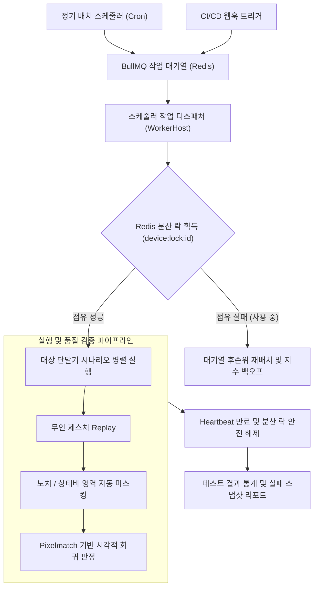

# 서버 무인 배치 스케줄러 및 분산 락 기반 디바이스 팜 운영

## 1. 개요 및 대규모 테스트 과제

개발자가 로컬 PC에서 1:1로 테스트하는 환경을 넘어, 사내에 구축된 수십 대의 모바일 실기기(Android 랙, Mac mini 기반 iOS 랙, Docker redroid 가상 디바이스 풀)를 대상으로 **야간 무인 회귀 테스트**를 수행할 때 다음과 같은 동시성 문제가 발생합니다:

1. **기기 점유 충돌 (Device Contention)**: 서로 다른 프로젝트나 빌드 파이프라인이 동일한 물리 단말기에 동시에 접근하여 테스트가 상호 간섭되거나 비정상 종료되는 현상.
2. **비정상 종료 시 기기 잠김 (Deadlock)**: 테스트 실행 도중 러너 프로세스가 강제 종료되면 단말기 세션이 점유된 채 방치되어 후속 테스트가 영구 대기하는 현상.
3. **노치 및 상태 표시줄로 인한 시각적 오탐**: 배터리 잔량 표시, 시계 분/초 변경, 전면 카메라 노치 영역으로 인해 이미지 픽셀 비교 시 실제 앱 결함이 아님에도 실패로 오인하는 문제.

`SyncETA`는 **NestJS Scheduler & BullMQ 큐**, **Redis 분산 락**, 그리고 **지능형 영역 마스킹 엔진**을 통해 대규모 디바이스 팜의 무인 자동화를 구현하였습니다.

---

## 2. Redis 분산 락 기반 기기 점유 제어

단말기 중복 제어를 방지하기 위해 Redis를 활용한 분산 락 메커니즘을 적용합니다.

- **락 획득 규격**:
  - 키 포맷: `device:lock:{platform}:{deviceId}` (예: `device:lock:android:emulator-5554`)
  - 원자적 연산: Redis `SET key value NX PX 120000` (기본 타임아웃 120초)
- **Heartbeat 갱신 및 안전 해제**:
  - 테스트 러너 프로세스는 매 30초마다 락의 만료 시간(TTL)을 갱신합니다.
  - 만약 네트워크 단절이나 프로세스 비정상 크래시가 발생하더라도, 120초 후 Redis 키가 자동으로 만료(Auto-Release)되어 단말기가 영구 잠김 상태에 빠지는 것을 방지합니다.

---

## 3. 노치 및 상태바 자동 마스킹 시각적 회귀 검증

모바일 화면의 픽셀 단위 회귀 검증(Visual Regression Testing) 시 불필요한 오탐을 제거하기 위해 3단계 마스킹 파이프라인을 가동합니다.

1. **상단 상태 표시줄(Status Bar) 정적 마스킹**:
   - 기기별 OS 설정에서 수집된 상단 바 높이(예: Android 24dp, iOS 다이내믹 아일랜드 54pt) 영역을 비교 대상에서 제외(Zero-Alpha 처리)합니다.
2. **하단 제스처 내비게이션 바(Home Bar) 마스킹**:
   - 전체 화면 모드가 아닌 경우 하단 16~20dp 영역의 시스템 바를 마스킹합니다.
3. **Pixelmatch 기반 유효 임계치 비교**:
   - 마스킹된 영역을 제외한 본문 컨텐츠 영역에 대해 `pixelmatch` 라이브러리를 실행하여, 픽셀 차이율이 사전에 정의된 허용 임계치(예: 0.1% 이하) 이내인 경우 정상으로 판정합니다.

---

## 4. 야간 배치 파이프라인 운영 기준

- **스케줄링 주기**: 매일 새벽 02:00 ~ 05:00에 전사 등록 시나리오 전수 회귀 테스트 실행.
- **실패 시 격리 보존**:
  - 테스트 실패 감지 시 즉시 현재 화면 캡처, 직전 10초간의 로그캣(Logcat) 또는 시스템 콘솔 로그를 번들링하여 S3/MinIO에 영구 적재.
  - 실패 지점의 화면과 기준(Baseline) 화면의 차이점을 오버레이한 Diff 이미지를 리포트에 자동 첨부하여 익일 아침 개발팀이 원인을 즉시 파악할 수 있도록 지원합니다.
