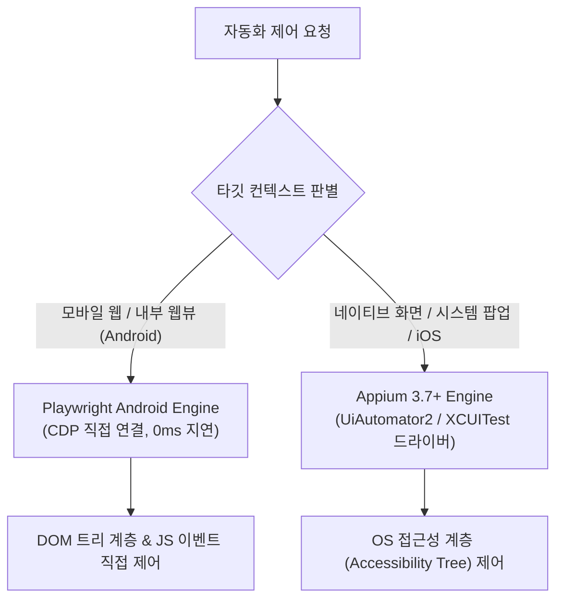

# Playwright Android 및 Appium 3.7+ 듀얼 자동화 엔진 명세

## 1. 듀얼 엔진 도입 배경

모바일 애플리케이션 환경은 크게 **순수 네이티브 앱**, **모바일 웹**, 그리고 웹과 네이티브가 결합된 **하이브리드 앱(Flutter, React Native, WebView)**으로 나뉩니다.

단일 자동화 프레임워크만을 사용할 경우 다음과 같은 한계가 발생합니다:
- **Appium 단독 사용 시**: 모바일 웹이나 복잡한 웹뷰 환경에서 DOM 이벤트 추적 및 스크립트 실행 지연시간이 길어 실시간 레코딩 인터랙션이 저하됨.
- **Playwright 단독 사용 시**: 브라우저 컨텍스트 외부의 모바일 시스템 권한 다이얼로그(카메라/위치 허용 팝업), 하드웨어 뒤로가기 버튼, 푸시 알림 확인 등을 제어할 수 없음.

`SyncETA`는 이러한 제약을 극복하기 위해 **Playwright Android**와 **Appium 3.7+ (UiAutomator2 / XCUITest)**를 단일 통합 세션 내에서 결합한 **듀얼 자동화 엔진 아키텍처**를 채택하고 있습니다.



---

## 2. 엔진별 역할 및 라우팅 전략

| 제어 영역 | 주 구동 엔진 | 통신 프로토콜 | 주요 제어 대상 |
| :--- | :--- | :--- | :--- |
| **모바일 웹 & 웹뷰 (Android)** | Playwright Android | Chrome DevTools Protocol (CDP) | DOM 요소 조작, 쿠키/세션 제어, 네트워크 모킹 |
| **모바일 웹 (iOS Safari)** | Playwright WebKit / Appium | WebKit Remote Debug Protocol | Safari 웹 페이지 렌더링 검증 |
| **네이티브 컴포넌트** | Appium 3.7+ | W3C WebDriver 프로토콜 | 네이티브 버튼, 리스트뷰, 내비게이션 바 |
| **시스템 다이얼로그 & 하드웨어** | Appium 3.7+ | ADB Shell / WDA 엔드포인트 | 권한 승인 팝업, 볼륨/홈/뒤로가기 키, 생체인증 |

---

## 3. 크로스 플랫폼 공통 추상화 계층 (`IMobileAutomationService`)

프론트엔드 레코더 및 백엔드 배치 실행기는 대상 플랫폼(Android/iOS)이나 사용 중인 서브 엔진의 내부 구현을 직접 알 필요 없이, 단일화된 공통 인터페이스를 통해 명령을 전달합니다.

```typescript
export interface IMobileAutomationService {
  /** 디바이스 세션 초기화 및 타깃 앱 구동 */
  initSession(config: IMobileSessionConfig): Promise<void>;

  /** 정규화 좌표 기준 단일 탭 동작 수행 */
  tapAtCoordinate(normalizedX: number, normalizedY: number): Promise<void>;

  /** 시계열 스와이프 제스처 수행 */
  swipe(
    startX: number, startY: number,
    endX: number, endY: number,
    durationMs: number
  ): Promise<void>;

  /** 가상 키보드 또는 하드웨어 키 입력 */
  pressKey(keyCode: string): Promise<void>;

  /** 단말기 화면 캡처 버퍼 반환 */
  takeScreenshot(): Promise<Buffer>;

  /** 네이티브와 웹뷰 간 컨텍스트 스위칭 */
  switchContext(contextId: 'NATIVE_APP' | string): Promise<void>;

  /** 현재 화면의 UI 트리 계층 구조(XML/JSON) 추출 */
  getPageSource(): Promise<string>;

  /** 세션 정상 종료 및 리소스 해제 */
  close(): Promise<void>;
}
```

---

## 4. 하이브리드 앱 컨텍스트 스위칭 동작 원리

사용자가 하이브리드 앱을 탐색하는 도중 웹뷰 컴포넌트로 진입하면, 엔진은 자동으로 가용 컨텍스트 목록을 폴링합니다:

1. **컨텍스트 감지**:
   - `driver.getContexts()`를 호출하여 `['NATIVE_APP', 'WEBVIEW_com.example.app']` 목록을 수신합니다.
2. **원자적 전환**:
   - 웹뷰 내부 요소 클릭 시 컨텍스트를 `WEBVIEW_*`로 전환하여 CDP 바인딩을 활성화하고 고속 DOM 파싱을 수행합니다.
3. **네이티브 복귀**:
   - 결제 모듈이나 시스템 카메라 팝업이 노출되는 즉시 컨텍스트를 다시 `NATIVE_APP`으로 전환하여 네이티브 버튼을 클릭합니다.
- 이 모든 과정은 시나리오 레코드 내에 `contextChange` 플래그로 자동 기록되므로 재실행 시에도 오류 없이 컨텍스트가 전환됩니다.
