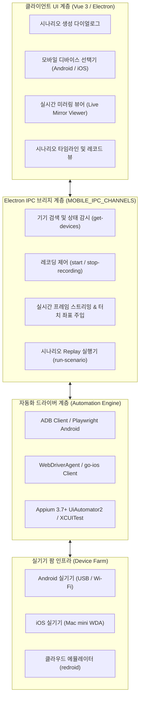

# 모바일 (Android & iOS) 시나리오 E2E 시스템 아키텍처

## 1. 개요 및 배경

기존 웹 브라우저 기반의 뷰포트 축소나 단순 User-Agent 에뮬레이션 방식은 실제 모바일 단말기(Android 및 iOS)에서 발생하는 터치 제스처, 모바일 렌더링 엔진 특성, 시스템 권한 다이얼로그(위치, 카메라, 알림) 및 하드웨어 키 입력을 온전히 검증하는 데 한계가 있습니다.

`SyncETA`의 모바일 테스트 아키텍처는 사용자가 USB 또는 원격 네트워크(Wi-Fi ADB / WDA)로 연결된 실제 모바일 기기를 바탕으로, 데스크톱 시나리오 생성과 일원화된 인터랙션으로 **모바일 사용자 동작을 녹화(Record)**하고 이를 실기기에서 **무인 재실행(Replay)하여 회귀 테스트를 수행**할 수 있는 파이프라인을 제공합니다.



---

## 2. 3계층 시스템 구성 요소

전체 모바일 자동화 시스템은 역할에 따라 3개 계층으로 분리되어 동작합니다.

### 1) 프론트엔드 UI 계층 (Client Presentation)
- **기기 선택기**: 로컬 PC 및 네트워크에 연결된 모바일 기기를 자동 검색하여 모델명, OS 버전, 해상도(DPI), 배터리 상태 및 실시간 연결 상태를 목록화합니다.
- **실시간 미러링 스튜디오**: 단말기 화면을 지연 없이 스트리밍하며, 사용자의 마우스 클릭 및 드래그 입력을 모바일 단말의 터치 이벤트로 실시간 릴레이합니다.
- **시나리오 타임라인**: 캡처된 터치, 스와이프, 키 입력 동작을 단계별 카드 형태로 가시화하고 검증 어설션(Assertion)을 추가할 수 있는 인터페이스를 제공합니다.

### 2) Electron IPC 브리지 계층 (System Bridge)
- 렌더러 프로세스와 메인 프로세스 간의 비동기 통신을 담당하며, 스트리밍 바이너리 데이터와 디바이스 제어 신호를 분리된 채널(`MOBILE_IPC_CHANNELS`)로 라우팅합니다:
  - `mobile:get-devices`: 실시간 연결 단말기 목록 갱신
  - `mobile:inject-touch`: 사용자 클릭 좌표의 실기기 즉각 주입
  - `mobile:stream-frame`: 단말기 화면 버퍼 프레임 수신

### 3) 자동화 엔진 계층 (Execution Engine)
- 대상 단말기의 OS 및 타깃 애플리케이션의 성격(웹뷰, 네이티브 앱)에 따라 최적의 드라이버를 동적으로 선택하는 공통 인터페이스(`IMobileAutomationService`)를 제공합니다.

---

## 3. 정규화된 모바일 시나리오 데이터 모델

모바일에서 수집되는 모든 사용자 동작은 기기 해상도에 종속되지 않도록 정규화된 속성을 포함하여 저장됩니다:

```typescript
export interface IMobileRecord {
  /** 레코드 고유 식별자 */
  id: string;
  /** 동작 유형 (TAP, SWIPE, LONG_PRESS, INPUT_TEXT, KEY_EVENT) */
  actionType: MobileActionType;
  /** 무차원 정규화 상대 좌표계 (0.0 ~ 1.0) */
  normalizedCoords: {
    x: number;
    y: number;
  };
  /** 스와이프 동작 시 종료 좌표 (해당 시) */
  normalizedEndCoords?: {
    x: number;
    y: number;
  };
  /** 제스처 지속 시간 (밀리초) */
  durationMs: number;
  /** 입력 텍스트 내용 (텍스트 입력 동작 시) */
  inputValue?: string;
  /** 물리 키 코드 (BACK, HOME, VOLUME_UP 등) */
  keyCode?: string;
  /** 이벤트 발생 시점의 시각 앵커 및 접근성 노드 메타데이터 */
  nodeMetadata?: {
    accessibilityId?: string;
    resourceId?: string;
    className?: string;
    bounds?: [number, number, number, number];
  };
}
```

---

## 4. 원천 특허 기술과의 연계

본 모바일 시나리오 아키텍처는 대한민국 특허청 정식 등록 완료된 웹 레코딩 원천 특허(**특허 제10-2025-0125736호**)의 설계 철학을 모바일 영역으로 확장한 것으로, 추가 출원 준비 중인 **특허 제21호(모바일 제스처 레코딩 및 AI 자연어 테스트케이스 자동화)**의 핵심 하드웨어 결합 실시 형태로 구현되어 있습니다.
