# SyncLLM 시스템 아키텍처

SyncLLM은 모든 클라이언트 요청이 외부 LLM 프로바이더로 전달되기 전과 응답이 반환된 후를 제어하는 **4계층 인라인 파이프라인(Inline Pipeline)**으로 설계되었습니다.

---

## 파이프라인 구조도

```mermaid
flowchart LR
    subgraph Layer1 ["1. Ingress Gateway Layer"]
        direction TB
        API["OpenAI 호환 API 엔드포인트
/v1/chat/completions"]
        Auth["API Key 인증 & 테넌트 식별"]
        RateLimit["토큰 버킷 레이트 리미터"]
    end

    subgraph Layer2 ["2. Security Guardrail Layer"]
        direction TB
        PIIFilter["PII Regex / NER 마스킹"]
        InjectionDetect["Prompt Injection 방어"]
        SchemaValidate["입력 JSON 스키마 검증"]
    end

    subgraph Layer3 ["3. Semantic Cache & Routing"]
        direction TB
        Embedding["경량 텍스트 임베딩 생성"]
        VectorSearch["Vector DB 코사인 유사도 검색"]
        ModelRouter["인텐트/비용 기반 모델 라우터"]
    end

    subgraph Layer4 ["4. FinOps & Provider Adapter"]
        direction TB
        Adapter["OpenAI / Anthropic / vLLM 어댑터"]
        CostCalculator["실시간 토큰 비용 정산"]
        AuditLog["감사 로그 및 메트릭 전송"]
    end

    Layer1 --> Layer2 --> Layer3 --> Layer4
```

---

## 계층별 상세 설명

### 1. Ingress Gateway Layer
- **OpenAI 규격 완벽 호환**: `/v1/chat/completions`, `/v1/embeddings` 표준 인터페이스를 제공하여 기존 애플리케이션 코드를 수정하지 않고 Base URL만 변경하여 즉시 도입 가능합니다.
- **멀티테넌트 인증 및 접근 제어**: 조직(Org), 프로젝트(Project), 서비스 계정(SA) 단위로 API Key를 발급하고 세분화된 권한을 제어합니다.
- **적응형 트래픽 쓰로틀링**: 초당 요청 수(RPS)와 분당 토큰 수(TPM)를 기반으로 클라이언트의 과도한 버스트 요청을 제어합니다.

### 2. Security Guardrail Layer
- **사전 PII 마스킹 (Pre-Request Masking)**: 요청 프롬프트가 외부 클라우드로 전송되기 전 메모리 상에서 주민등록번호, 전화번호, 카드번호, 사내 비밀번호를 `[REDACTED_PII]` 형태로 치환합니다.
- **역방향 복원 (Post-Response Re-hydration)**: 모델 응답에 마스킹된 토큰의 맥락이 필요한 경우, 안전한 세션 스토어에 임시 보관된 식별자를 매핑하여 클라이언트에 전달합니다.
- **프롬프트 인젝션 가드**: 시스템 프롬프트 탈취, 가드레일 우회(Jailbreak) 패턴을 탐지하여 비정상 요청을 즉시 차단합니다.

### 3. Semantic Cache & Routing Layer
- **시맨틱 임베딩 검색**: 고속 임베딩 모델을 통해 입력 프롬프트의 의미적 벡터를 추출하고, 유사도 임계치(\(\ge 0.95\)) 이상의 기존 질의응답이 존재할 경우 외부 API 호출 없이 캐시를 반환합니다.
- **작업 복잡도 분류 (Task Complexity Classifier)**:
  - 단순 분류, 포맷팅, 번역, 문법 교정: 가성비 높은 경량 모델로 라우팅.
  - 고난도 수학, 다단계 논리 추론, 복잡한 아키텍처 코드 작성: 최고 성능 플래그십 모델로 라우팅.

### 4. FinOps & Provider Adapter Layer
- **동적 공급자 어댑터**: 각 LLM 프로바이더의 독자 API 포맷(Anthropic Messages API, Google Vertex AI, vLLM 로컬 엔드포인트)을 표준 규격으로 자동 변환합니다.
- **실시간 토큰 원장 (Real-time Token Ledger)**: Prompt Tokens, Completion Tokens, Cached Tokens를 모델별 요율에 따라 실시간 비용($)으로 환산하여 데이터베이스에 기록합니다.
- **자동 페일오버 (Automatic Failover)**: 주 공급자의 5xx 장애 또는 429 Rate Limit 발생 시, 동일 티어의 백업 프로바이더로 수 ms 내 투명하게 요청을 재시도합니다.
