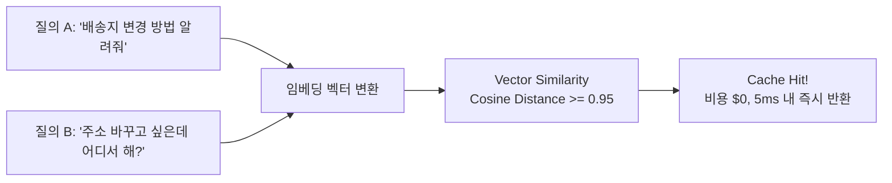

# FinOps 토큰 예산 관리 & 시맨틱 캐시

생성형 AI 도입이 확산될수록 기업의 가장 큰 고민은 **예측 불가능한 API 비용 증가**입니다. SyncLLM은 정밀한 시맨틱 캐싱과 실시간 비용 거버넌스를 통해 이 문제를 해결합니다.

---

## 1. 벡터 기반 시맨틱 캐싱 (Semantic Cache)

기존 웹 캐시(Key-Value)는 문자열이 한 글자만 달라도 캐시 미스(Cache Miss)가 발생합니다. 반면 **SyncLLM 시맨틱 캐시**는 프롬프트의 의미적 임베딩을 비교합니다.



- **임계치 기반 유사도 검증**: 코사인 유사도 \(\ge 0.95\) 이상일 때만 캐시를 재사용하여 왜곡된 답변 반환을 방지합니다.
- **TTL 및 무효화 정책**: 데이터 변경 주기에 따라 캐시 수명(TTL)을 유연하게 설정하며, 특정 도메인 지식 업데이트 시 해당 태그의 캐시를 즉시 무효화할 수 있습니다.

---

## 2. FinOps 토큰 예산 원장 (Token Budget Ledger)

SyncLLM은 모든 인출 토큰에 대해 실시간 회계 처리를 수행합니다.

| 관리 계층 | 제어 항목 | 정책 예시 |
| :--- | :--- | :--- |
| **조직 단위** | 월간 고정 예산 상한선 | 전사 월 $10,000 초과 시 신규 프롬프트 승인 모드로 전환 |
| **부서/프로젝트** | 팀별 쿼터 및 알림 임계치 | 마케팅팀 일 500,000 토큰 초과 시 관리자 Slack 알림 |
| **사용자/에이전트** | 단일 요청 토큰 리밋 | 1회 프롬프트 Max Input 16k, Max Output 4k 강제 |

```json
{
  "transaction_id": "tx_9f82a1c0",
  "tenant_id": "dept_sales_01",
  "model": "gpt-4o-mini",
  "tokens": {
    "prompt": 420,
    "completion": 180,
    "total": 600,
    "cached": 0
  },
  "cost_usd": 0.000171,
  "latency_ms": 342,
  "status": "SUCCESS"
}
```
