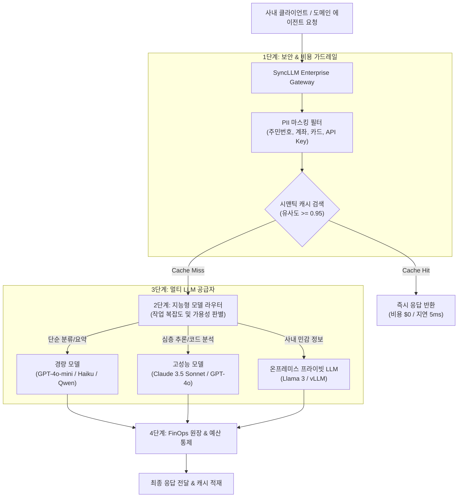

# SyncLLM: 엔터프라이즈 AI 게이트웨이 & FinOps

> **Empasy SyncSeries Enterprise AI Gateway & FinOps Engine**  
> 지능형 모델 라우팅, 시맨틱 캐싱, 토큰 예산 관리 및 개인정보 보호 플랫폼

**SyncLLM**은 기업 내 분산된 모든 AI 호출을 일원화하여 관리하는 **엔터프라이즈 전용 AI 게이트웨이(Enterprise AI Gateway)**입니다.

기업 내 여러 조직과 에이전트들이 제각각 상용 LLM API(OpenAI, Anthropic, Google, 로컬 온프레미스 모델 등)를 직접 호출할 경우 발생하는 **비용 통제 분산, 중복 호출로 인한 토큰 낭비, 민감 개인정보(PII) 유출 위험**을 방지하고, 단일 진입점에서 체계적인 거버넌스와 비용 최적화를 제공합니다.

---

## 핵심 도입 가치

1. **지능형 모델 라우팅 (Intelligent Multi-LLM Routing)**:
   - 프롬프트 난이도 및 의도를 실시간 분석하여 최적의 가성비 모델(경량 모델 vs 고성능 모델)로 동적 분기합니다.
   - 특정 벤더의 API 장애나 Rate Limit 도달 시 즉시 차순위 공급자로 자동 장애 조치(Failover)를 수행합니다.

2. **시맨틱 캐싱 (Vector-based Semantic Caching)**:
   - 단순 문자열 일치를 넘어 임베딩 벡터 코사인 유사도(\(\ge 0.95\)) 기반 캐싱을 지원합니다.
   - 유사한 의미의 반복 질의에 대해 외부 API 호출 없이 캐시된 응답을 제공하여 토큰 비용과 지연시간을 절감합니다.

3. **엔터프라이즈 FinOps 토큰 예산 관리 (Token Budget Ledger)**:
   - 조직, 프로젝트, 사용자 단위로 토큰 소비량을 실시간 집계하고 일/월별 쿼터 한도를 강제합니다.
   - 예산 임계치 도달 시 알림 발송 및 사용량 차단 정책을 적용할 수 있습니다.

4. **철저한 개인정보 보호 및 가드레일 (PII Masking & Safety Guardrails)**:
   - 주민등록번호, 휴대폰 번호, 신용카드 번호, 사내 인증키 등 민감 정보를 전처리 단계에서 실시간 마스킹합니다.
   - 악의적인 프롬프트 인젝션이나 비인가 데이터 반출 시도를 게이트웨이 레벨에서 사전 차단합니다.

---

## 4대 기능 요약

| 영역 | 주요 기능 | 기대 효과 |
| :--- | :--- | :--- |
| **게이트웨이 & 라우팅** | OpenAI 호환 엔드포인트, 동적 모델 스위칭, 로드밸런싱 | 단일 API 규격 유지, 벤더 종속 탈피 |
| **시맨틱 캐싱** | 벡터 유사도 기반 캐시 적중, TTL 만료 관리, 인메모리/Redis 연동 | 토큰 비용 최대 40% 절감, 응답 시간 단축 |
| **FinOps 원장** | 실시간 토큰 사용량 트래킹, 쿼터 제어, 예산 초과 방지 | 예측 가능한 AI 운영 비용 관리 |
| **보안 가드레일** | 정규식/NER 기반 PII 자동 마스킹, 프롬프트 인젝션 차단 | 기업 컴플라이언스 준수, 데이터 유출 방지 |
