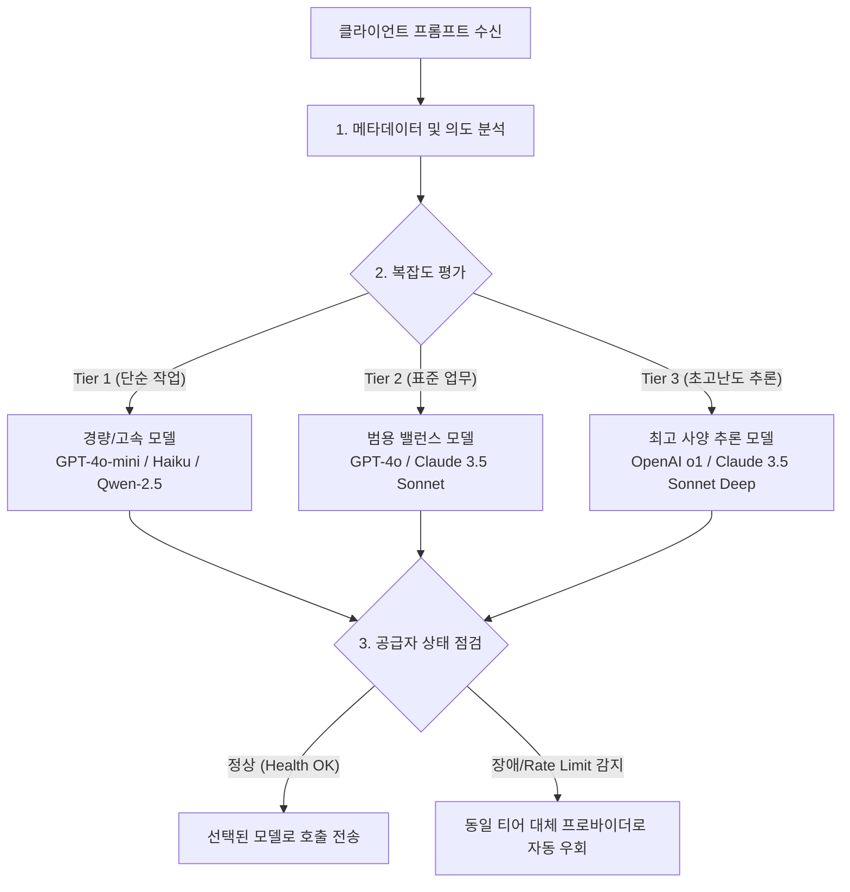

# 지능형 모델 라우팅 & 로드밸런싱

기업의 모든 AI 업무에 최고 사양의 고비용 플래그십 모델을 사용하는 것은 불필요한 예산 낭비를 초래합니다. 반대로 지나치게 경량화된 모델만 사용할 경우 답변 품질 저하가 발생합니다.

**SyncLLM Intelligent Router**는 입력 프롬프트의 복잡도와 서비스 수준 협약(SLA), 비용 효율성을 종합 고려하여 최적의 모델을 동적으로 배정합니다.

---

## 3단계 라우팅 전략

### 1. 작업 복잡도 기반 티어링 (Complexity-based Tiering)
- **단순 가공 (Tier 1)**: 정형 JSON 변환, 맞춤법 교정, 텍스트 요약, 감정 분석 등은 토큰 단가가 수십 배 저렴한 소형 모델로 즉시 분기합니다.
- **심층 추론 (Tier 2/3)**: 멀티스텝 비즈니스 계획 수립, 복합 알고리즘 구현, SQL 쿼리 최적화 등 정밀한 논리 구조가 요구되는 요청은 고성능 모델로 안전하게 할당합니다.

### 2. 가용성 기반 자동 페일오버 (Automatic Failover)
상용 클라우드 AI 서비스는 간헐적인 Rate Limit(429)이나 서버 과부하(503)를 겪을 수 있습니다.
- SyncLLM은 서킷 브레이커(Circuit Breaker)를 내장하여 특정 공급자의 장애 발생 시 0.1초 내 동일 등급의 대체 모델로 트래픽을 자동 우회합니다.
- 사용자에게는 에러 없이 일관된 정상 응답을 반환하여 서비스 무중단성을 보장합니다.

### 3. 가중치 기반 로드밸런싱 (Weighted Round-Robin)
- 동일 모델에 대해 여러 공급자 계정(예: Azure OpenAI 리전 1, 리전 2, 오리지널 OpenAI API)을 등록하고 가중치에 따라 트래픽을 분산 처리함으로써 쿼터 한계치를 극복합니다.
