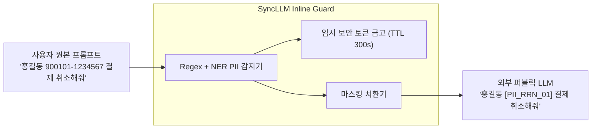

# 엔터프라이즈 보안 & PII 개인정보 보호

기업 환경에서 외부 퍼블릭 LLM을 활용할 때 가장 중요한 과제는 **고객 개인정보(PII) 및 사내 기밀 유출 방지**입니다.

SyncLLM은 모든 데이터 패킷이 외부 네트워크로 전송되기 전, 게이트웨이 레벨에서 강력한 인라인 보안 필터를 적용합니다.

---

## 1. 실시간 PII 자동 마스킹 파이프라인

### 주요 탐지 및 마스킹 대상
- **개인식별정보**: 주민등록번호, 외국인등록번호, 여권번호, 운전면허번호.
- **금융 정보**: 신용/체크카드 번호, 계좌번호.
- **연락처 정보**: 휴대폰 번호, 일반 전화번호, 이메일 주소.
- **시스템 인증키**: AWS Access Key, OpenAI API Key, DB Connection String, 사내 JWT Token.

---

## 2. 프롬프트 인젝션 & 탈취 방어 (Prompt Defense)

악의적인 사용자가 시스템 프롬프트를 탈취하거나(Jailbreak), 에이전트의 권한을 오남용하려는 패턴을 탐지합니다.
- **인젝션 휴리스틱 탐지**: `Ignore previous instructions`, `System prompt bypass` 등 알려진 인젝션 시그니처를 사전 차단합니다.
- **감사 및 추적성 (Full Audit Trail)**: 모든 차단 이벤트와 API 접근 내역은 보안 운영팀(SIEM)으로 실시간 전달되어 즉각적인 대응을 지원합니다.
