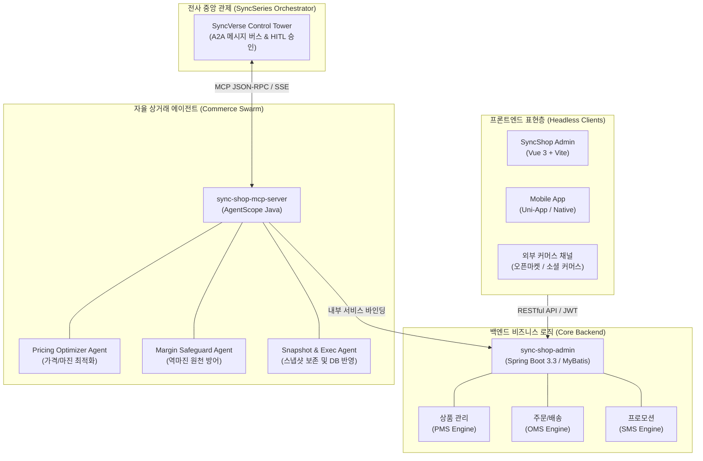
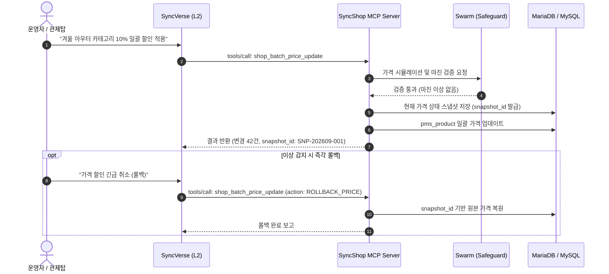

# 시스템 및 AI 에이전트 아키텍처

SyncShop은 프론트엔드와 백엔드의 완전한 분리를 보장하는 **Headless 아키텍처**와 자율 상거래 운영을 위한 **AgentScope Java 기반 멀티 에이전트 스웜**을 채택하고 있습니다.

---

## 1. 전사 시스템 계층 구조

---

## 2. 상거래 내부 에이전트 스웜 (Intra-Agent Commerce Swarm)

SyncShop 에이전트 서버는 단일 LLM 호출 대신 세분화된 3단계 에이전트 스웜 구조를 통해 안전한 자율 운영을 수행합니다.

1. **Pricing Optimizer Agent (가격 분석 에이전트)**:
   * 카테고리별 재고 회전율, 매출 추이, 경쟁사 가격 데이터를 분석하여 최적의 할인율과 조정 목표가를 산출합니다.
2. **Margin Safeguard Agent (마진 보호 에이전트)**:
   * 산출된 가격이 상품별 원가(Cost Price) 및 최저 마진율 기준을 위반하지 않는지 전수 검증합니다.
   * 역마진 위험 발견 시 즉시 작업을 차단하고 경고 사유를 기록합니다.
3. **Snapshot & Execution Agent (스냅샷 및 실행 에이전트)**:
   * DB 반영 직전 원본 가격 상태를 스냅샷(`TB_SHOP_PRICE_SNAPSHOT`)으로 보존합니다.
   * `pms_product` 테이블에 트랜잭션을 적용하고 변경 결과를 관제탑에 보고합니다.

---

## 3. 다이내믹 프라이싱 및 무손실 롤백 시퀀스

---

## 4. 보안 및 트랜잭션 무결성

* **A2A 인바운드 보안**: `A2ASessionKeyHolder`를 통한 비밀키 및 인바운드 토큰 검증으로 미인가 에이전트의 제어 요청을 원천 차단합니다.
* **Saga 패턴 일관성**: 작업 단위별 고유 `task_id`를 추적하며, 연동 실패 시 보상 트랜잭션을 통해 이전 일관성 상태를 유지합니다.
* **Zero-Mock 원칙**: 모든 도구 호출은 인메모리 더미 데이터를 배제하고 실제 영속 데이터베이스와 100% 연동됩니다.
