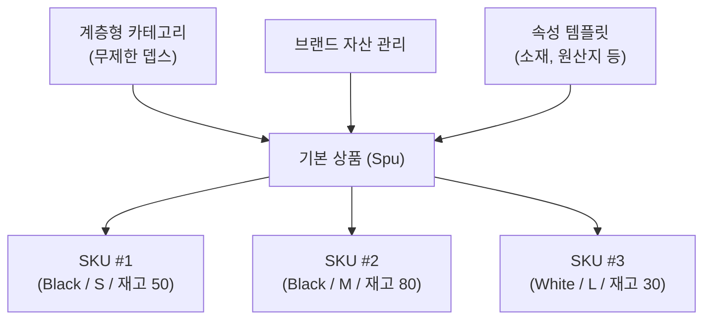
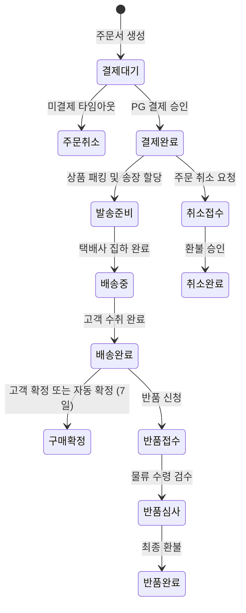

# 상품 카탈로그 및 주문 물류 관리

SyncShop의 상품 관리(PMS)와 주문 관리(OMS)는 대규모 이커머스 운영 환경에서 데이터 정합성과 신속한 처리 속도를 보장하도록 설계되었습니다.

---

## 1. 상품 카탈로그 관리 (PMS)

### 1.1 계층형 카테고리 및 브랜드
* **무제한 계층 구조**: 대분류-중분류-소분류로 이어지는 다단 카테고리를 지원하며, 상위 카테고리 변경 시 하위 매핑이 동적으로 재계산됩니다.
* **브랜드 자산 관리**: 로고, 브랜드 스토리, 공식 인증 여부를 관리하고 브랜드 전용관 큐레이션과 연동합니다.

### 1.2 동적 SKU 및 재고 잠금 (Inventory Lock)
* **옵션 조합별 SKU 분리**: 색상, 사이즈, 용량 등의 옵션 조합마다 고유 SKU 코드, 개별 판매가, 안전 재고 수량을 지정합니다.
* **재고 잠금 메커니즘**: 사용자가 주문 결제 단계에 진입하면 Redis 분산 락을 통해 재고를 임시 점유(Lock)하고, 결제 완료 시 실재고를 차감합니다. 결제 실패 또는 타임아웃(기본 15분) 발생 시 점유가 즉각 자동 해제됩니다.

---

## 2. 주문 및 물류 관리 (OMS)

### 2.1 주문 상태 전이 라이프사이클

### 2.2 주문 처리 주요 기능
* **송장 자동 대량 등록**: 엑셀 업로드 및 택배사 API 연동을 통한 대량 운송장 번호 바인딩 및 배송중 상태 일괄 전환.
* **반품/환불 2단계 심사**: 고객의 반품 신청 접수 후 실물 회수 검수와 환불 승인 단계를 분리하여 오지급 방지.
* **배송 발송 센터 관리**: 복수의 물류 창고(강남, 송파, 판교 등)를 등록하고 주문 인입 시 최적 배송 거점을 지정.

---

## 3. 관련 관리자 화면 코드 매핑

| 기능 영역 | 화면 식별자 | Vue 컴포넌트 경로 | 설명 |
|:---|:---|:---|:---|
| **카탈로그 조회** | `SHOP-02` | `src/views/pms/product/index.vue` | 상품 목록 검색, 진열 상태 토글, 다이내믹 가격 조정 |
| **신규 상품 등록** | `SHOP-03` | `src/views/pms/product/add.vue` | 기본 정보, SKU 매트릭스 설정, 속성 템플릿 입력 |
| **카테고리/브랜드** | `SHOP-04` | `src/views/pms/productCate/index.vue` | 트리형 카테고리 구성 및 브랜드 목록 관리 |
| **주문/배송 관제** | `SHOP-05` | `src/views/oms/order/index.vue` | 실시간 주문 접수, 송장 처리, 배송 추적 |
| **반품/환불 심사** | `SHOP-06` | `src/views/oms/orderReturnApply/index.vue` | 반품 사유 검토, 물류 상태 확인, 환불 승인 |
