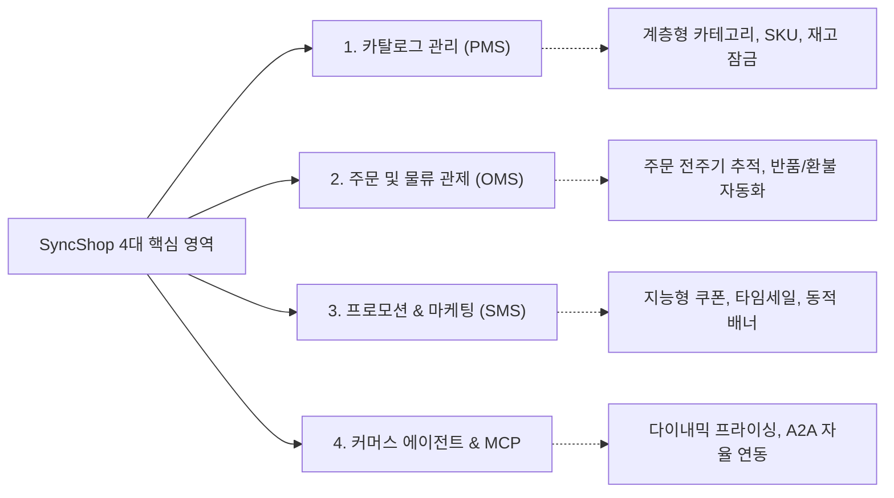

# SyncShop: 지능형 커머스 운영 플랫폼 개요

SyncShop은 비즈니스 유연성과 채널 확장성을 위해 백엔드 상거래 로직과 프론트엔드 표현층을 분리한 **Headless eCommerce** 플랫폼입니다.

모든 핵심 기능을 RESTful API 및 표준 MCP(Model Context Protocol) 도구로 제공하여 웹, 모바일 앱, 키오스크, 소셜 커머스 등 다양한 고객 접점을 통합 제어하며, Spring Boot 3 기반 MSA 구조와 AgentScope Java 에이전트 하네스를 통해 자율 상거래 운영을 지원합니다.

---

## 4대 핵심 기능 영역

1. **상품 카탈로그 관리 (PMS - Product Management System)**:
   * 무제한 뎁스의 계층형 카테고리와 브랜드 자산 관리.
   * 색상, 사이즈, 용량 등 옵션 조합별 SKU 단가 및 재고 분리 제어.
   * 실시간 재고 잠금(Lock) 및 저재고 알림을 통한 품절 및 과다 재고 방지.

2. **주문 및 물류 관제 (OMS - Order Management System)**:
   * 결제 대기부터 발송 준비, 배송 중, 수취 완료까지 전 상태 추적.
   * 반품 및 환불 신청 심사 프로세스 표준화.
   * 다중 배송지 및 복수 물류 발송 센터 통합 관리.

3. **프로모션 및 마케팅 (SMS - Sales Management System)**:
   * 조건부 타깃 발급 쿠폰(가입, 등급, 특정 상품군) 엔진.
   * 특정 시간대 한정 수량 특가 타임세일(Flash Sale) 세션 운영.
   * 메인 디스플레이 추천 브랜드 및 전략 상품 진열 순서 제어.

4. **자율 상거래 에이전트 및 MCP 연동 (Commerce Agent & MCP)**:
   * `shop_batch_price_update` 기반 실시간 DB 다이내믹 프라이싱 및 스냅샷 원복.
   * `manage_product_catalog`, `manage_orders`를 통한 재고 및 주문 상태 자율 제어.
   * AgentScope Java 기반 에이전트 스웜 및 SyncVerse 중앙 관제탑과의 A2A 협업.

---

## 솔루션 구성 요약

| 영역 | 구성 요소 | 주요 기술 스택 | 설명 |
|:---|:---|:---|:---|
| **백엔드 서버** | `sync-shop-admin` | Java 21, Spring Boot 3.3, MyBatis | RESTful 커머스 API, 트랜잭션 및 보안(JWT, RBAC) |
| **에이전트 서버** | `sync-shop-mcp-server` | AgentScope Java, Spring Web, MCP SDK | A2A 도구 제공, 다이내믹 프라이싱, 비동기 관제 연동 |
| **관리자 UI** | `SyncShop Admin` | Vue 3, Vite, TypeScript, Ant Design Vue | 상거래 종합 운영 대시보드 및 백오피스 관제 화면 |
| **모바일/클라이언트** | `SyncShop App` | Vue / Uni-App | 옴니채널 모바일 커머스 프론트엔드 |

---

## 주요 문서 바로가기

* [시스템 아키텍처 및 에이전트 스웜](/syncshop/architecture)
* [상품 및 주문 물류 운영](/syncshop/catalog-and-order)
* [프로모션, 쿠폰 및 기획전](/syncshop/promotion-and-marketing)
* [MCP 도구 및 A2A 오케스트레이션](/syncshop/mcp-and-agent)
* [자주 묻는 질문 (FAQ)](/syncshop/enterprise-faq)
