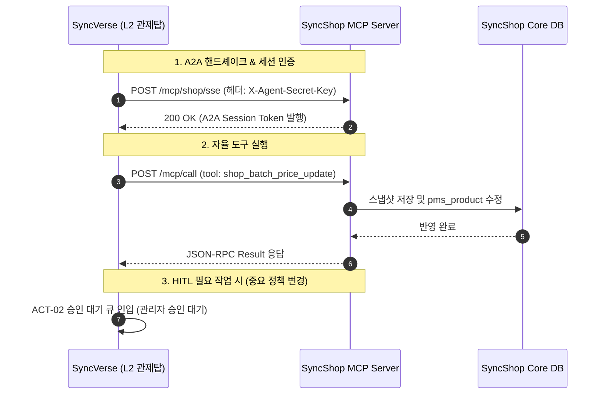

# MCP 도구 및 A2A 오케스트레이션

SyncShop은 모든 관리 기능과 상거래 제어 인터페이스를 표준 **Model Context Protocol (MCP)** 도구로 노출하여, SyncVerse 중앙 관제탑 및 타 도메인 에이전트와의 자율 협업을 지원합니다.

---

## 1. MCP 도구 레지스트리 명세

SyncShop MCP 서버(`sync-shop-mcp-server`)에서 기본 제공하는 프로덕션 도구 목록입니다.

| 도구명 (Tool Name) | 주요 입력 파라미터 | 반환 타입 (JSON) | 설명 |
|:---|:---|:---|:---|
| **`shop_batch_price_update`** | `action` (BATCH_UPDATE_PRICE / ROLLBACK_PRICE)<br>`categoryId` (Long, 선택)<br>`rate` (Double, 할인/인상율)<br>`snapshotId` (String, 롤백 시 필수) | `PriceUpdateResult` | 실제 `pms_product` DB 기반 가격 일괄 조정 및 스냅샷 원복 |
| **`manage_product_catalog`** | `action` (CREATE / UPDATE / DELETE / STOCK)<br>`productPayload` (Map) | `CatalogActionResult` | 상품 마스터 CRUD 및 옵션별 재고 수량 갱신 |
| **`manage_orders`** | `action` (SEARCH / CONFIRM / CANCEL / REFUND / SHIP)<br>`orderSn` (String)<br>`payload` (Map, 선택) | `OrderActionResult` | 주문 상태 전이, 배송 처리 및 반품 심사 승인 |
| **`shop_update_checkout_policy`** | `policyKey` (String)<br>`policyValue` (String) | `PolicyUpdateResult` | 배송비 무료 기준, 최소 주문 금액, 결제 정책 변경 |
| **`shop_fetch_commerce_logs`** | `logLevel` (INFO/WARN/ERROR)<br>`orderSn` (String, 선택)<br>`limit` (Integer) | `List<CommerceLogRecord>` | 결제 이상, PG사 연동 장애, 재고 부족 추적 로그 수집 |
| **`revert_data_state`** | `taskId` (String)<br>`snapshotId` (String) | `RevertResult` | 분산 Saga 트랜잭션 실패 시 이전 안정 상태로 보상 복원 |

---

## 2. 세부 도구 파라미터 규격

### 2.1 `shop_batch_price_update` (다이내믹 프라이싱)

실시간 상거래 데이터베이스와 직접 바인딩되어 가격을 일괄 변경하며, 변경 직전 스냅샷을 자동 발행합니다.

```json
{
  "name": "shop_batch_price_update",
  "arguments": {
    "action": "BATCH_UPDATE_PRICE",
    "categoryId": 104,
    "rate": 0.9,
    "reason": "시즌오프 아우터 프로모션 적용"
  }
}
```

* **성공 응답 예시**:
```json
{
  "status": "SUCCESS",
  "snapshotId": "SNP-202609-089",
  "affectedCount": 42,
  "backupTimestamp": "2026-09-24T10:15:30Z",
  "message": "카테고리 104번 대상 42개 품목 가격 일괄 인하 완료 (10% 할인)"
}
```

### 2.2 `manage_orders` (주문 상태 제어)

```json
{
  "name": "manage_orders",
  "arguments": {
    "action": "SHIP",
    "orderSn": "ORD-20260924-0012",
    "payload": {
      "deliveryCompany": "CJ대한통운",
      "deliverySn": "6892019482"
    }
  }
}
```

---

## 3. SyncVerse 관제탑과의 A2A 연동 규격



* **보안 핸드셰이크**: `A2ASessionKeyHolder`를 통한 인바운드 보안 검증으로 권한 없는 외부 요청을 차단합니다.
* **거버넌스 승인 연동**: 전사 결제 정책 변경(`shop_update_checkout_policy`) 등 파급력이 큰 작업은 SyncVerse의 HITL 승인 게이트웨이를 필수로 거쳐 실행됩니다.
