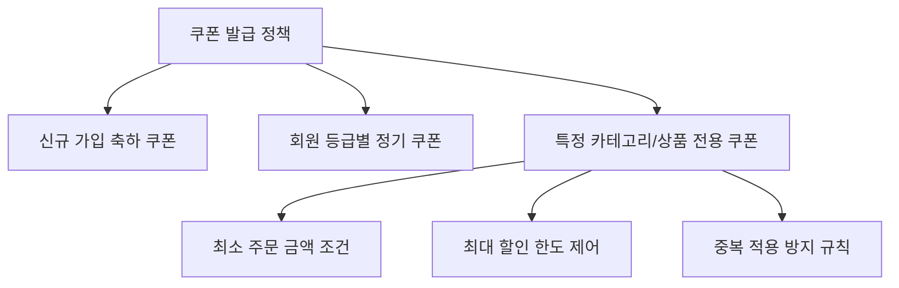

# 프로모션, 쿠폰 및 마케팅 관리

SyncShop의 마케팅 관리(SMS)는 매출 전환율을 극대화하고 마케터의 기획 의도를 신속하게 화면에 반영할 수 있는 강력한 프로모션 도구를 제공합니다.

---

## 1. 지능형 쿠폰 엔진

* **정밀한 타깃 발급**: 신규 회원, 특정 회원 등급, 장기 미구매 고객 대상 맞춤형 쿠폰 발행.
* **적용 제약 통제**: 특정 카테고리 또는 지정 상품 한정 적용, 최저 결제 금액 제한, 최대 할인 금액 상한선을 설정하여 마진 방어.
* **사용 이력 추적**: 쿠폰별 발급 수량 대비 실사용률을 실시간 집계하여 프로모션 ROI 측정.

---

## 2. 타임 세일 (Flash Sale) 세션 운영

특정 시간대에 한정된 수량만을 파격적인 특가로 판매하는 타임세일 기능을 제공합니다.

* **시간대별 세션 관리**: 일자별/시간대별(예: 10:00~14:00, 20:00~24:00) 독립 세션 생성 및 운영.
* **수량 한정 판매 및 카운트다운**: 세션별 판매 가능 한도 수량 지정 및 프론트엔드 실시간 잔여 시간/수량 카운트다운 연동.
* **동시 접속 제어**: 세션 시작 시 발생하는 트래픽 집중 상황에서 Redis 원자적 연산을 통한 오버셀(초과 판매) 원천 방지.

---

## 3. 전시 및 콘텐츠 마케팅

* **전략적 상품 진열**: 홈 화면의 추천 상품, 신규 론칭, 주간 베스트 섹션의 상품 노출 순서를 드래그 앤 드롭으로 즉각 재배치.
* **동적 배너 관리**: 단순 이미지 배너 외에 HTML5 및 비디오 기반 동적 배너를 지원하며, 노출 위치별 클릭률(CTR)과 전환 매출 추적.
* **매거진형 테마 기획전**: 특정 테마(예: 봄맞이 홈스타일링, 오피스 데스크 셋업)를 주제로 콘텐츠와 상품을 결합한 큐레이션 페이지 발행.

---

## 4. 관련 관리자 화면 코드 매핑

| 기능 영역 | 화면 식별자 | Vue 컴포넌트 경로 | 설명 |
|:---|:---|:---|:---|
| **프로모션 쿠폰** | `SHOP-07` | `src/views/sms/coupon/index.vue` | 쿠폰 생성, 발급 이력, 실사용 통계 조회 |
| **타임세일 기획전** | `SHOP-08` | `src/views/sms/flash/index.vue` | 타임세일 세션 구성 및 특가 상품 매핑 |
| **메인 배너 디스플레이** | `SHOP-09` | `src/views/sms/advertise/index.vue` | 홈/카테고리별 배너 등록 및 노출 순서 제어 |
| **매출 통계 분석** | `SHOP-10` | `src/views/sms/statistic/index.vue` | 일자별/상품별 매출 추이, 객단가, 전환율 리포트 |
