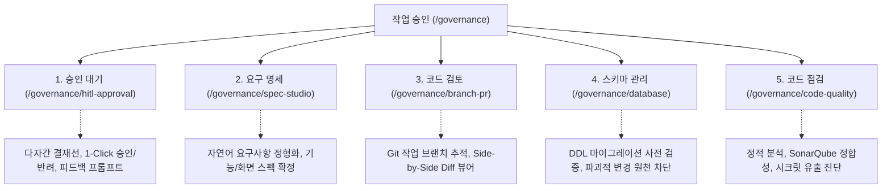

# 엔터프라이즈 작업 승인(HITL) 거버넌스 콘솔

SyncVerse는 AI 에이전트의 생성 속도를 극대화하면서도 데이터 손실이나 서비스 장애를 방지하기 위해 **작업 승인(Governance)** 전용 관제 체계를 독립 대분류로 승격하여 운용합니다.

---

## 1. 5대 작업 승인 관제 뷰 구조

SyncVerse Admin 콘솔은 복잡한 승인 절차를 실무 중심의 직관적인 5대 전문 화면으로 분리 제공합니다.

### 1.1 승인 대기 (`HitlApprovalView.vue`)
* 에이전트가 요청한 중요 변경(배포, 대량 가격 변경, 권한 승격 등) 건에 대해 아키텍트의 승인을 대기하는 실시간 큐입니다.
* 다자간 결재선(Multi-Approval Chain)을 지원하며 승인/반려 시 반려 사유를 입력하여 에이전트에게 자동 피드백을 전달합니다.

### 1.2 요구 명세 (`SpecStudioManageView.vue`)
* 사용자의 비정형 자연어 요구사항을 표준 기능 명세서 및 화면 명세서로 정형화하는 스펙 스튜디오입니다.
* 확정된 스펙만이 코딩 에이전트의 작업 지시서로 디스패치됩니다.

### 1.3 코드 검토 (`BranchPrManageView.vue`)
* 에이전트가 생성한 Git 작업 브랜치와 Pull Request(PR)의 변경 내역을 실시간 관제합니다.
* 변경 전후 소스코드를 Side-by-Side 방식으로 시각화하여 휴먼 리뷰어가 신속하게 변경점을 파악할 수 있도록 돕습니다.

### 1.4 스키마 관리 (`DatabaseGovernanceView.vue`)
* 신규 테이블 생성, 컬럼 변경 등 DDL 마이그레이션 스크립트를 사전에 검증합니다.
* `DROP TABLE`, 대규모 `TRUNCATE` 등 비가역적 파괴적 DDL을 원천 차단하고 소프트 삭제 또는 단계적 Deprecation을 강제합니다.

### 1.5 코드 점검 (`CodeQualityAuditView.vue`)
* 컴파일 무결성, Zero-Mock 준수 여부, 소나큐브 룰셋, 시크릿 유출 검사를 자동으로 수행하고 점검 리포트를 출력합니다.

---

## 2. AI와 시스템 아키텍트 간 R&R

| 운영 단계 | AI 에이전트 수행 작업 | 시스템 아키텍트 (사람) 수행 작업 |
|:---|:---|:---|
| **01. 요구사항 분석** | 자연어 지시 해석, 영향도 분석, 기능/화면 명세 초안 작성 | 요구사항 제시 및 스펙 스튜디오 최종 승인 |
| **02. 코드 생성 및 DDL** | 작업 브랜치 분기, 코드 작성, 3-File DDL 스크립트 도출 | *(개입 없음 - 자율 수행)* |
| **03. 테스트 및 품질 점검** | 무인 QA 회귀 검증, 정적 분석, Zero-Mock 하네스 검증 | 점검 리포트 및 지표 검토 |
| **04. 검토 및 승인 게이트** | 변경 Diff 요약 리포트, ERD 변경 다이어그램 제공 | **코드 검토 및 스키마 승인/반려 결정** |
| **05. 상용 배포 및 감사** | 무중단 롤아웃, Saga 트랜잭션 커밋, 감사 이력 보존 | 비상 상황 시 긴급 정지(Kill-Switch) 트리거 |

---

## 3. 엔터프라이즈 안전 가드레일

* **상용 배포 2단계 인증**: 프로덕션 배포 파이프라인 트리거 시 2단계 인증(2FA/OTP) 통과 필수.
* **파괴적 DDL 원천 차단**: 데이터 유실을 유발하는 파괴적 SQL 문맥 검출 시 즉각 작업 중단.
* **전사 비상 킬스위치 (Kill-Switch)**: 비정상 트랜잭션 감지 시 1-클릭으로 전체 에이전트 가동을 안전하게 정지(Safe Halt)하고 커넥션 격리.